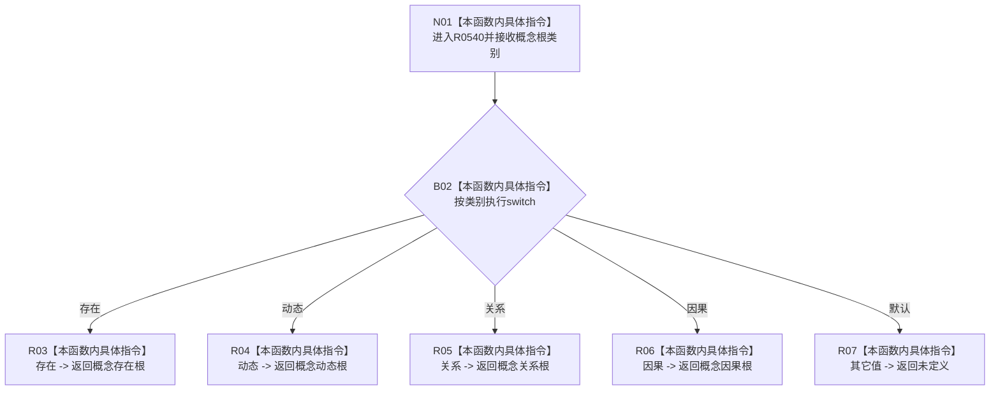

# CF-L8-0082 概念根对应系统角色用途现状流程图

图类型：现状流程图
代码版本：`0a93526882cb33c61c2fbb04ecad1aeaddcfe225`
工作区复核基线：`2089268fbb3833ebc77486169b98d8a14c49d508`
源码 blob：`a4090a7643aa12c41f2830eb5f51593aabde7488`
覆盖文件：`海中鱼巣/领域/概念活动状态.数据.h:73-81`
唯一根函数：R0540
完整签名：`inline 系统角色稳定键用途 海中鱼巣::概念根对应系统角色用途(概念根类别 类别) noexcept`
参数：`类别` 按值传入；允许任意底层枚举值
返回结果：存在、动态、关系、因果分别映射为四种概念根稳定键用途；其它值返回 `未定义`
已登记调用方：R0335（RCE1064）、R0338（RCE1073）、R0538（RCE1547）
直接项目函数：无
外部边界：无
逐行映射表：`流程图/代码流程图/L8/CF-L8-0082_概念根对应系统角色用途_逐行代码映射表.md`
结构读写：只读取值参数并返回枚举，不改变机器结构
不得作为施工许可：是
不得宣称：映射到非未定义用途代表对应系统角色身份、节点或关系已经存在

## 流程图

## 当前边界

- `switch` 覆盖四个规范概念根枚举项；任何其它底层值均进入 `default`。
- 本函数只执行枚举映射，不检查角色清单、稳定键绑定或节点记录。
