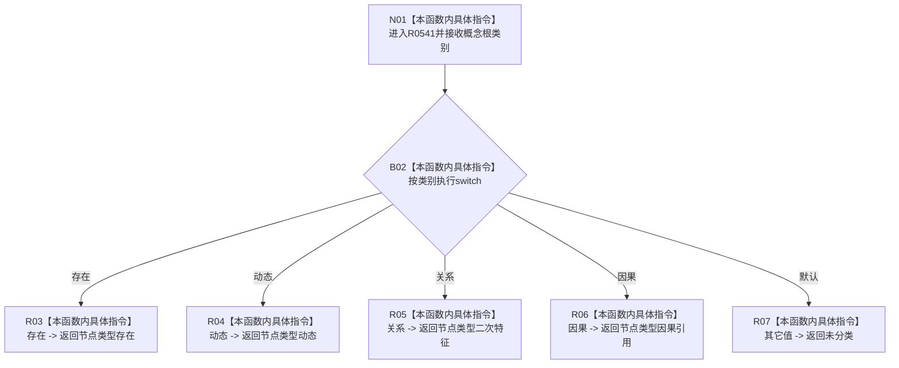

# CF-L8-0083 概念根对应节点类型现状流程图

图类型：现状流程图
代码版本：`0a93526882cb33c61c2fbb04ecad1aeaddcfe225`
工作区复核基线：`2089268fbb3833ebc77486169b98d8a14c49d508`
源码 blob：`a4090a7643aa12c41f2830eb5f51593aabde7488`
覆盖文件：`海中鱼巣/领域/概念活动状态.数据.h:83-91`
唯一根函数：R0541
完整签名：`inline 节点类型 海中鱼巣::概念根对应节点类型(概念根类别 类别) noexcept`
参数：`类别` 按值传入；允许任意底层枚举值
返回结果：存在、动态、关系、因果分别映射为 `存在`、`动态`、`二次特征`、`因果引用`；其它值返回 `未分类`
已登记调用方：R0335（RCE1065）、R0338（RCE1074）、R0538（RCE1548）
直接项目函数：无
外部边界：无
逐行映射表：`流程图/代码流程图/L8/CF-L8-0083_概念根对应节点类型_逐行代码映射表.md`
结构读写：只读取值参数并返回枚举，不改变机器结构
不得作为施工许可：是
不得宣称：映射到具体节点类型代表对应节点记录、主信息或概念根关系已经存在

## 流程图

## 当前边界

- 概念根类别 `关系` 映射为节点类型 `二次特征`，不是节点类型 `关系`。
- 本函数只执行枚举映射，不读取或校验任何节点记录。
