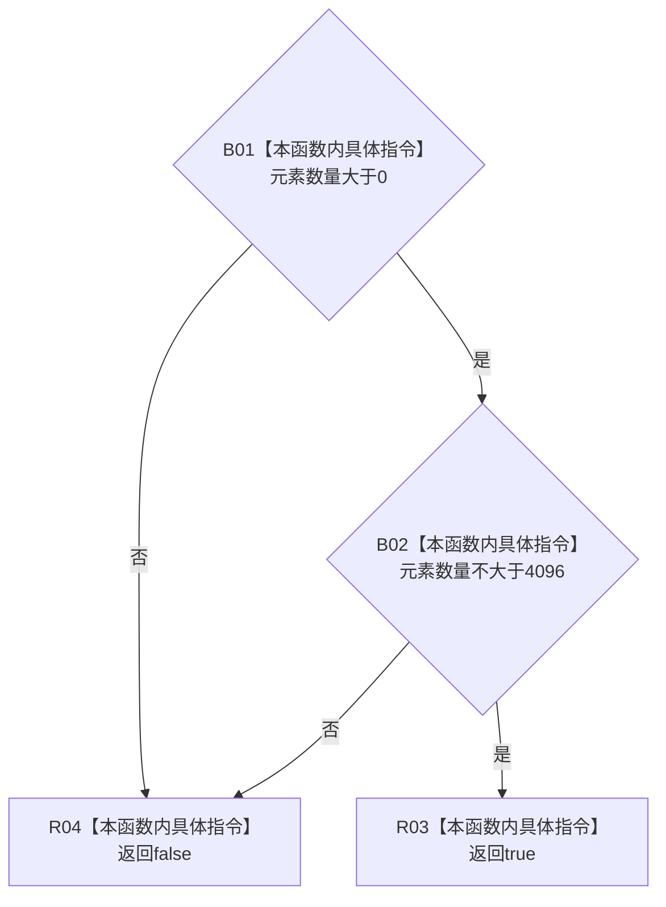

# CF-L8-0084 序列元素数量有效现状流程图

图类型：现状流程图
代码版本：`0a93526882cb33c61c2fbb04ecad1aeaddcfe225`
工作区复核基线：`2089268fbb3833ebc77486169b98d8a14c49d508`
源码 blob：`be8c82c78253b3bc7d3f4aa15a93660e0025bb06`
覆盖文件：`海中鱼巣/领域/特征值服务.h:576-578`
唯一根函数：R0543
完整签名：`static bool 海中鱼巣::特征值服务::序列元素数量有效(std::size_t 元素数量)`
参数：`元素数量` 按值输入，表示待检查序列的元素个数
返回结果：元素数量位于闭区间 `[1, 4096]` 时返回 `true`，否则返回 `false`
已登记调用方：R0544（RCE1552）、R0864（RCE3180）、R0866（RCE3199）
直接项目函数：无
外部边界：无
逐行映射表：`流程图/代码流程图/L8/CF-L8-0084_序列元素数量有效_逐行代码映射表.md`
结构读写：只读参数和类常量 `最大序列元素数量`
不得作为施工许可：是
不得宣称：数量有效代表序列内容、元素语义或调用方写入事务有效

## 流程图

## 当前边界

- `&&` 按从左到右短路；数量为零时不再比较上限。
- 本函数不读取序列对象，也不写任何项目结构。
