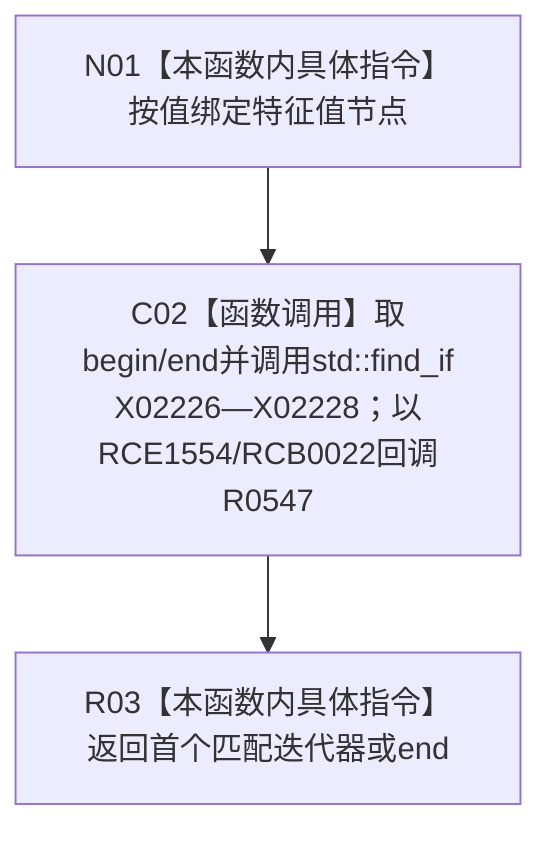

# CF-L8-0085 查找Vec记录已加锁可写重载现状流程图

图类型：现状流程图
代码版本：`0a93526882cb33c61c2fbb04ecad1aeaddcfe225`
工作区复核基线：`2089268fbb3833ebc77486169b98d8a14c49d508`
源码 blob：`be8c82c78253b3bc7d3f4aa15a93660e0025bb06`
覆盖文件：`海中鱼巣/领域/特征值服务.h:673-677`
唯一根函数：R0546
完整签名：`std::vector<海中鱼巣::特征值服务::Vec原始值记录>::iterator 海中鱼巣::特征值服务::查找Vec记录_已加锁(海中鱼巣::节点句柄 特征值节点)`
参数：`特征值节点` 按值输入；函数名要求调用方已持有适当锁，函数体不自行验证锁状态
返回结果：返回首个节点句柄匹配的可写 Vec 记录迭代器；无匹配时返回 `Vec记录表_.end()`
已登记调用方：R0264（RCE0875）、R0864（RCE3182）、R0866（RCE3201）
直接项目函数：R0547（RCE1554；由 RCB0022 在 `std::find_if` 内零到多次回调）
外部边界：X02226—X02228
逐行映射表：`流程图/代码流程图/L8/CF-L8-0085_查找Vec记录已加锁可写重载_逐行代码映射表.md`
结构读写：只读 Vec 记录表并返回可写迭代器，本函数不直接改写记录
不得作为施工许可：是
不得宣称：返回迭代器在锁释放或容器修改后仍有效

## 流程图

## 当前边界

- `std::find_if` 的区间与算法调用属于 R0546；lambda 正文由 R0547 独立覆盖。
- 函数不检查互斥锁持有事实，`已加锁` 是调用合同名称而非运行时门禁。
