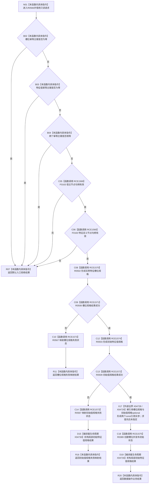

# CF-L8-0086 特征状态组合器创建槽位并发布初始状态现状流程图

图类型：现状流程图
代码版本：`0a93526882cb33c61c2fbb04ecad1aeaddcfe225`
工作区复核基线：`03a8b7ac099ccea83e57f2696e2290b7bcdfacaf`
源码 blob：`e1e70ac49fbfa683a9fbb238f57e123b18d22c01`
覆盖文件：`海中鱼巣/领域/组合.特征状态.ixx:29-41`
唯一根函数：R0566
完整签名：`海中鱼巣::特征体系业务结果 海中鱼巣::特征状态组合器::创建槽位并发布初始状态(const 海中鱼巣::创建槽位并发布初始状态请求& 请求) const`
参数：`请求` 为调用期只读借用；隐式 `this` 为 const 非拥有借用
返回结果：入口五项检查失败时返回默认入口拒绝；任一规格形成失败时映射失败状态；两份规格均成功时返回一次数据操作提交结果
已登记调用方：R0229（RCE0791）
直接项目函数：F0163（RCE1569，两处）、R0502（RCE1570）、R0508（RCE1571）、R0567（RCE1573，两处）、R0503（RCE1574）、R0509（RCE1572）、R0389（RCE1575）
外部边界：X04728 `optional<特征槽位写入规格>::operator*() const &`、X04729 `optional<初始特征值写入规格>::operator*() const &`、X04730 `初始特征值规格结果` 隐式析构
逐行映射表：`流程图/代码流程图/L8/CF-L8-0086_特征状态组合器创建槽位并发布初始状态_逐行代码映射表.md`
结构读写：本函数只形成请求规格并编排一次 R0389；实际结构事务由 R0389 承担
不得作为施工许可：是
不得宣称：规格形成成功等于槽位或初始状态已经提交，或两份规格的 optional 解引用顺序固定

## 流程图

## 当前边界

- 第 31—33 行五项入口检查按 `||` 从左到右短路；只有前四项均未拒绝时才执行第二次 F0163。
- 槽位规格失败发生在初始值规格形成前；初始值规格失败发生在 R0389 前。
- 第 40 行两个函数实参的求值先后未由源码固定；两次解引用完成后才进入 R0389。
- `特征槽位规格结果` 的隐式析构为平凡生命周期结束；`初始特征值规格结果` 含向量规格，离开作用域时执行非平凡析构。
