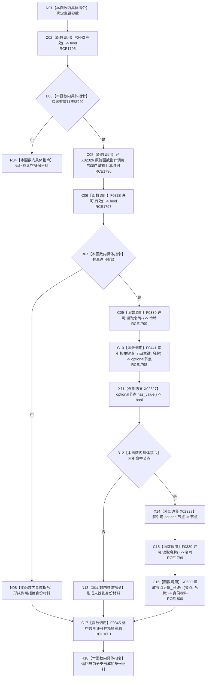

# CF-L8-0087 读取主键身份现状流程图

图类型：现状流程图
代码版本：`03a8b7ac099ccea83e57f2696e2290b7bcdfacaf`
当前工作区复核基线：`7cbd2167eb5f6d495f48657a0e5badb07c52a358`
源码 blob：`524922ab2f3d0d76cfed4bdd517f0d7d57e1ae6a`
覆盖文件：`海中鱼巣/领域/数据操作.存在场景.ixx:167-174`
唯一根函数：R0626
完整签名：`海中鱼巣::节点身份材料 海中鱼巣::存在场景数据操作::读取主键身份(std::uint64_t 主键) const`
参数：`主键` 按值输入；0 为非法值
返回结果：入口无效返回默认空材料；许可拒绝或未找到返回对应读取状态；命中时返回 R0630 形成的节点身份材料
调用图：`流程图/主程序可达调用关系/01_main可达项目调用边表.md`
输入契约 / 调用语境表：本图“当前边界”节；未另建独立表
非成功返回二分审查表：本图返回节点与“当前边界”节；未另建独立表
偏差清单：无 / 不适用；本图只登记当前实现事实
依据提交 / 结构化消息：源码冻结 `03a8b7ac099ccea83e57f2696e2290b7bcdfacaf`；无结构化执行消息
验证输出：配对逐行映射、节点集合、源码 blob 与本批机械审计
已登记调用方：R0621、R0627、R0633、R0643、R0646、R0650、R0652（RCE1792、RCE1802、RCE1817、RCE1883、RCE1889、RCE1909、RCE1931）
直接项目函数：F0442、F0397、F0338、F0441、F0339、R0630、F0345（RCE1795—RCE1801）
外部边界：X02326—X02328
逐行映射表：`流程图/代码流程图/L8/CF-L8-0087_读取主键身份_逐行代码映射表.md`
结构读写：只读接线、索引、节点和主信息路径；共享许可在所有形成许可后的退出路径析构释放
不得作为施工许可：是
不得宣称：主键命中即代表身份完整，或读取结果已经过运行验证

## 流程图

## 当前边界

- 许可一旦形成，许可拒绝、索引未命中和成功读回都先经 RCE1801 释放许可，再返回结果。
- R0630 独立承载节点、主信息和虚拟来源关系的一致性读回，本图不展开其内部过程。
