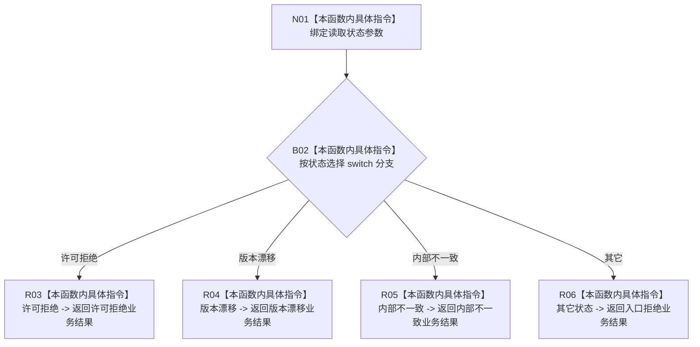

# CF-L8-0089 映射读取失败现状流程图

图类型：现状流程图
代码版本：`03a8b7ac099ccea83e57f2696e2290b7bcdfacaf`
当前工作区复核基线：`7cbd2167eb5f6d495f48657a0e5badb07c52a358`
源码 blob：`02daea05100474053ac5153e3616a1a6dd74dd0a`
覆盖文件：`海中鱼巣/领域/服务.场景.ixx:67-78`
唯一根函数：R0628
完整签名：`海中鱼巣::存在场景业务结果 海中鱼巣::场景业务服务::映射读取失败(海中鱼巣::存在场景读取状态 状态) noexcept`
参数：`状态` 按值输入
返回结果：许可拒绝、版本漂移、内部不一致分别映射为同名业务状态；其它读取状态映射为入口拒绝
调用图：`流程图/主程序可达调用关系/01_main可达项目调用边表.md`
输入契约 / 调用语境表：本图“当前边界”节；未另建独立表
非成功返回二分审查表：本图返回节点与“当前边界”节；未另建独立表
偏差清单：无 / 不适用；本图只登记当前实现事实
依据提交 / 结构化消息：源码冻结 `03a8b7ac099ccea83e57f2696e2290b7bcdfacaf`；无结构化执行消息
验证输出：配对逐行映射、节点集合、源码 blob 与本批机械审计
已登记调用方：R0621（RCE1794）
直接项目函数：无
外部边界：无
逐行映射表：`流程图/代码流程图/L8/CF-L8-0089_映射读取失败_逐行代码映射表.md`
结构读写：只读值参数并返回值式结果，不修改结构
不得作为施工许可：是
不得宣称：默认分支能够保留未列出的读取状态语义

## 流程图

## 当前边界

- `未找到`、`已找到` 和 `入口拒绝` 等未单列状态均进入默认分支并映射为入口拒绝。
