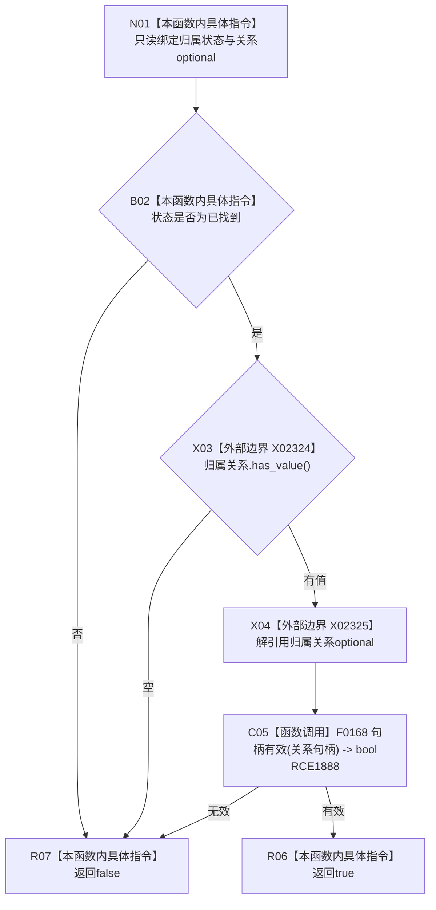

# CF-L8-0090 场景归属材料已归属现状流程图

图类型：现状流程图
代码版本：`03a8b7ac099ccea83e57f2696e2290b7bcdfacaf`
当前工作区复核基线：`7cbd2167eb5f6d495f48657a0e5badb07c52a358`
源码 blob：`524922ab2f3d0d76cfed4bdd517f0d7d57e1ae6a`
覆盖文件：`海中鱼巣/领域/数据操作.存在场景.ixx:73-76`
唯一根函数：R0644
完整签名：`bool 海中鱼巣::场景归属材料::已归属() const noexcept`
参数：无显式参数；只读状态与归属关系 optional
返回结果：状态为已找到、归属关系有值且关系句柄有效时返回 `true`
调用图：`流程图/主程序可达调用关系/01_main可达项目调用边表.md`
输入契约 / 调用语境表：本图“当前边界”节；未另建独立表
非成功返回二分审查表：本图返回节点与“当前边界”节；未另建独立表
偏差清单：无 / 不适用；本图只登记当前实现事实
依据提交 / 结构化消息：源码冻结 `03a8b7ac099ccea83e57f2696e2290b7bcdfacaf`；无结构化执行消息
验证输出：配对逐行映射、节点集合、源码 blob 与本批机械审计
已登记调用方：R0643（RCE1886）、R0651（RCE1919）、R0652（RCE1947）
直接项目函数：F0168（RCE1888）
外部边界：X02324（`has_value`）、X02325（解引用）
逐行映射表：`流程图/代码流程图/L8/CF-L8-0090_场景归属材料已归属_逐行代码映射表.md`
结构读写：只读值式材料，不访问仓库
不得作为施工许可：是
不得宣称：关系句柄有效代表关系仍当前有效或端点权威一致

## 流程图

## 当前边界

- 三项条件按 `&&` 左到右短路。
- 本函数不验证场景、存在端点或关系仓库记录。
