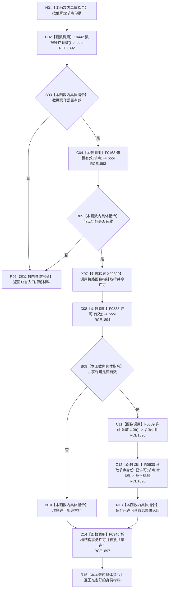

# CF-L8-0093 存在场景数据操作读取节点身份现状流程图

图类型：现状流程图
代码版本：`03a8b7ac099ccea83e57f2696e2290b7bcdfacaf`
当前工作区复核基线：`7cbd2167eb5f6d495f48657a0e5badb07c52a358`
源码 blob：`524922ab2f3d0d76cfed4bdd517f0d7d57e1ae6a`
覆盖文件：`海中鱼巣/领域/数据操作.存在场景.ixx:176-181`
唯一根函数：R0648
完整签名：`海中鱼巣::节点身份材料 海中鱼巣::存在场景数据操作::读取节点身份(海中鱼巣::节点句柄 节点) const`
参数：`节点` 按值输入
返回结果：入口无效返回缺省材料；许可拒绝返回具名状态；否则返回已许可节点身份读取结果
调用图：`流程图/主程序可达调用关系/01_main可达项目调用边表.md`
输入契约 / 调用语境表：本图“当前边界”节；未另建独立表
非成功返回二分审查表：本图返回节点与“当前边界”节；未另建独立表
偏差清单：无 / 不适用；本图只登记当前实现事实
依据提交 / 结构化消息：源码冻结 `03a8b7ac099ccea83e57f2696e2290b7bcdfacaf`；无结构化执行消息
验证输出：配对逐行映射、节点集合、源码 blob 与本批机械审计
已登记调用方：R0643（RCE1881）、R0651（RCE1915）、R0652（RCE1929）
直接项目函数：F0442（RCE1892）、F0163（RCE1893）、F0338（RCE1894）、F0339（RCE1895）、R0630（RCE1896）、F0345（RCE1897）
外部边界：X02329（取得共享许可原始函数指针）
逐行映射表：`流程图/代码流程图/L8/CF-L8-0093_存在场景数据操作读取节点身份_逐行代码映射表.md`
结构读写：只读节点结构；许可在所有取得后的退出路径析构释放
不得作为施工许可：是
不得宣称：返回已找到代表调用方业务类型或幂等语义成立

## 流程图

## 当前边界

- 入口拒绝发生在取得许可前；取得许可后所有返回均经过 F0345 析构释放。
- 实际身份读取由 R0630 的独立现状图承载。
