# CF-L8-0094 存在场景数据操作读取场景归属现状流程图

图类型：现状流程图
代码版本：`03a8b7ac099ccea83e57f2696e2290b7bcdfacaf`
当前工作区复核基线：`7cbd2167eb5f6d495f48657a0e5badb07c52a358`
源码 blob：`524922ab2f3d0d76cfed4bdd517f0d7d57e1ae6a`
覆盖文件：`海中鱼巣/领域/数据操作.存在场景.ixx:183-231`
唯一根函数：R0649
完整签名：`海中鱼巣::场景归属材料 海中鱼巣::存在场景数据操作::读取场景归属(海中鱼巣::节点句柄 场景, 海中鱼巣::节点句柄 存在) const`
参数：场景与存在节点句柄均按值输入
返回结果：返回保留两端点的入口拒绝、许可拒绝、合并读取失败、未找到、已找到或内部不一致材料
调用图：`流程图/主程序可达调用关系/01_main可达项目调用边表.md`
输入契约 / 调用语境表：本图“当前边界”节；未另建独立表
非成功返回二分审查表：本图返回节点与“当前边界”节；未另建独立表
偏差清单：无 / 不适用；本图只登记当前实现事实
依据提交 / 结构化消息：源码冻结 `03a8b7ac099ccea83e57f2696e2290b7bcdfacaf`；无结构化执行消息
验证输出：配对逐行映射、节点集合、源码 blob 与本批机械审计
已登记调用方：R0643（RCE1885）、R0651（RCE1918）、R0652（RCE1946）
直接项目函数：F0442（RCE1898）、F0163（RCE1899）、F0338（RCE1900）、F0339（RCE1901）、R0630（RCE1902）、R0653（RCE1903）、R0078（RCE1904）、F0051（RCE1905）、R0654（RCE1906）、F0440（RCE1907）、F0345（RCE1908）
外部边界：X02330—X02335、X04841—X04844
逐行映射表：`流程图/代码流程图/L8/CF-L8-0094_存在场景数据操作读取场景归属_逐行代码映射表.md`
结构读写：在一个共享许可和同一令牌下只读节点与关系；仅修改局部输出、optional 与循环游标
不得作为施工许可：是
不得宣称：已找到材料已通过外部持久验证，或内部不一致已被修复

## 流程图

```mermaid
flowchart TD
    N01["N01【本函数内具体指令】绑定场景与存在节点句柄"]
    N02["N02【本函数内具体指令】默认构造入口拒绝输出材料"]
    N03["N03【本函数内具体指令】写入输出.场景"]
    N04["N04【本函数内具体指令】写入输出.存在"]
    C05["C05【函数调用】F0442 数据操作有效() -> bool<br/>RCE1898"]
    B06{"B06【本函数内具体指令】数据操作是否有效"}
    C07["C07【函数调用】F0163 句柄有效(场景) -> bool<br/>RCE1899"]
    B08{"B08【本函数内具体指令】场景句柄是否有效"}
    C09["C09【函数调用】F0163 句柄有效(存在) -> bool<br/>RCE1899"]
    B10{"B10【本函数内具体指令】存在句柄是否有效"}
    R11["R11【本函数内具体指令】返回入口拒绝输出"]
    X12["X12【外部边界 X02330】调用接线函数指针取得共享许可"]
    C13["C13【函数调用】F0338 许可.有效() -> bool<br/>RCE1900"]
    B14{"B14【本函数内具体指令】共享许可是否有效"}
    N15["N15【本函数内具体指令】输出状态置许可拒绝"]
    N16["N16【本函数内具体指令】保存输出供返回"]
    C17["C17【函数调用】F0339 许可.读取令牌() -> 令牌引用<br/>RCE1901"]
    C18["C18【函数调用】R0630 读取场景身份_已许可 -> 场景材料<br/>RCE1902"]
    C19["C19【函数调用】R0630 读取存在身份_已许可 -> 存在材料<br/>RCE1902"]
    B20{"B20【本函数内具体指令】两份身份状态是否均为已找到"}
    C21["C21【函数调用】R0653 合并读取失败(两状态) -> 状态<br/>RCE1903"]
    N22["N22【本函数内具体指令】输出状态置合并读取失败"]
    N23["N23【本函数内具体指令】保存输出供返回"]
    B24{"B24【本函数内具体指令】场景类型与存在类型是否分别正确"}
    N25["N25【本函数内具体指令】输出状态置入口拒绝"]
    N26["N26【本函数内具体指令】保存输出供返回"]
    C27["C27【函数调用】R0078 获取归属关系记录组(场景,令牌) -> 记录组<br/>RCE1904"]
    X28["X28【外部边界 X04841】默认构造空命中optional"]
    X29["X29【外部边界 X02331】记录组.begin()/end() -> 范围游标"]
    X30{"X30【外部边界 X04842】const_iterator::operator!= -> 是否还有记录"}
    X31["X31【外部边界 X04843】const_iterator::operator* -> 当前记录"]
    C32["C32【函数调用】F0051 比较记录目标与存在节点<br/>RCE1905"]
    B33{"B33【本函数内具体指令】当前记录目标是否匹配"}
    X34{"X34【外部边界 X02332】命中.has_value()"}
    B35{"B35【本函数内具体指令】是否已经命中过记录"}
    C36["C36【函数调用】R0654 形成多归属内部不一致材料<br/>RCE1906"]
    N37["N37【本函数内具体指令】保存内部不一致材料供返回"]
    X38["X38【外部边界 X02334】命中 = 当前记录"]
    X39["X39【外部边界 X04844】const_iterator::operator++ 推进游标"]
    X40{"X40【外部边界 X02332】遍历后命中.has_value()"}
    B41{"B41【本函数内具体指令】是否存在唯一命中记录"}
    N42["N42【本函数内具体指令】输出状态置未找到"]
    N43["N43【本函数内具体指令】保存输出供返回"]
    X44["X44【外部边界 X02333】读取命中记录关系编号与版本号"]
    N45["N45【本函数内具体指令】构造完整关系句柄"]
    C46["C46【函数调用】F0440 按完整句柄读取关系 -> optional<br/>RCE1907"]
    X47{"X47【外部边界 X02332】当前关系.has_value()"}
    B48{"B48【本函数内具体指令】完整关系是否存在"}
    X49["X49【外部边界 X02333】读取当前关系类型与端点"]
    C50["C50【函数调用】F0051 比较源端点与场景、目标端点与存在<br/>RCE1905"]
    B51{"B51【本函数内具体指令】类型和两个端点是否权威一致"}
    C52["C52【函数调用】R0654 形成权威读回内部不一致材料<br/>RCE1906"]
    N53["N53【本函数内具体指令】保存内部不一致材料供返回"]
    N54["N54【本函数内具体指令】输出状态置已找到"]
    X55["X55【外部边界 X02335】输出.归属关系 = 关系句柄值"]
    N56["N56【本函数内具体指令】保存已找到输出供返回"]
    C57["C57【函数调用】F0345 析构结构事务许可并释放共享许可<br/>RCE1908"]
    R58["R58【本函数内具体指令】返回准备好的场景归属材料"]
    N01 --> N02 --> N03 --> N04 --> C05 --> B06
    B06 -- 否 --> R11
    B06 -- 是 --> C07 --> B08
    B08 -- 否 --> R11
    B08 -- 是 --> C09 --> B10
    B10 -- 否 --> R11
    B10 -- 是 --> X12 --> C13 --> B14
    B14 -- 否 --> N15 --> N16 --> C57
    B14 -- 是 --> C17 --> C18 --> C19 --> B20
    B20 -- 否 --> C21 --> N22 --> N23 --> C57
    B20 -- 是 --> B24
    B24 -- 否 --> N25 --> N26 --> C57
    B24 -- 是 --> C27 --> X28 --> X29 --> X30
    X30 -- 有记录 --> X31 --> C32 --> B33
    B33 -- 不匹配 --> X39 --> X30
    B33 -- 匹配 --> X34 --> B35
    B35 -- 已有命中 --> C36 --> N37 --> C57
    B35 -- 首次命中 --> X38 --> X39
    X30 -- 遍历结束 --> X40 --> B41
    B41 -- 无命中 --> N42 --> N43 --> C57
    B41 -- 有唯一命中 --> X44 --> N45 --> C46 --> X47 --> B48
    B48 -- 否 --> C52 --> N53 --> C57
    B48 -- 是 --> X49 --> C50 --> B51
    B51 -- 否 --> C52
    B51 -- 是 --> N54 --> X55 --> N56 --> C57
    C57 --> R58
```

## 当前边界

- 入口无效在取得许可前返回；取得许可后的所有路径均经 F0345 释放。
- 同一场景和存在出现多条当前归属，或完整句柄读回不一致，均进入 R0654 内部不一致。
- 节点身份、关系记录枚举和完整关系读回全部共享同一令牌。
