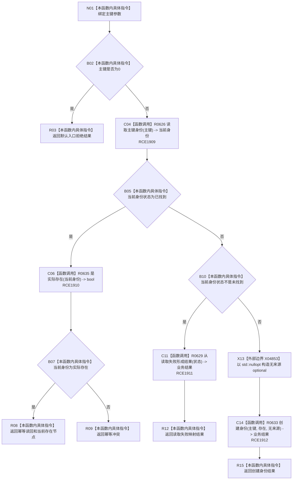

# CF-L8-0095 存在场景创建实际存在现状流程图

图类型：现状流程图
代码版本：`03a8b7ac099ccea83e57f2696e2290b7bcdfacaf`
当前工作区复核基线：`f19e4b0e001554d25b1cf0847dbcfb0b52d4e22c`
源码 blob：`524922ab2f3d0d76cfed4bdd517f0d7d57e1ae6a`
覆盖文件：`海中鱼巣/领域/数据操作.存在场景.ixx:256-268`
唯一根函数：R0650
完整签名：`海中鱼巣::存在场景业务结果 海中鱼巣::存在场景数据操作::创建实际存在(std::uint64_t 主键) const`
参数：`主键` 按值输入；0 为非法值
返回结果：主键0返回默认入口拒绝；既有实际存在返回幂等读回，既有其它身份返回幂等冲突；读取失败经 R0629 映射；未找到时经 R0633 创建无来源的存在身份
调用图：`流程图/主程序可达调用关系/01_main可达项目调用边表.md`
输入契约 / 调用语境表：本图“当前边界”节；未另建独立表
非成功返回二分审查表：本图返回节点与“当前边界”节；未另建独立表
偏差清单：无 / 不适用；本图只登记当前实现事实
依据提交 / 结构化消息：源码冻结 `03a8b7ac099ccea83e57f2696e2290b7bcdfacaf`；无结构化执行消息
验证输出：配对逐行映射、节点集合、源码 blob 与本批机械审计
已登记调用方：R0646（RCE1890）
直接项目函数：R0626、R0635、R0629、R0633（RCE1909—RCE1912）
外部边界：X04853（从 `std::nullopt` 构造 `std::optional<节点句柄>`）
逐行映射表：`流程图/代码流程图/L8/CF-L8-0095_存在场景创建实际存在_逐行代码映射表.md`
结构读写：先只读当前主键身份；仅未找到分支委托 R0633 尝试结构写入
不得作为施工许可：是
不得宣称：调用创建入口必然提交结构，或幂等读回已经过运行验证

## 流程图

## 当前边界

- 本函数把既有虚拟存在、场景或其它非实际存在身份统一裁决为幂等冲突。
- R0633 独立承载写事务、提交、写后读回和失败映射。
