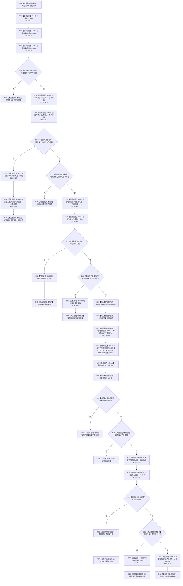

# CF-L8-0096 存在场景创建场景归属现状流程图

图类型：现状流程图
代码版本：`03a8b7ac099ccea83e57f2696e2290b7bcdfacaf`
当前工作区复核基线：`f19e4b0e001554d25b1cf0847dbcfb0b52d4e22c`
源码 blob：`524922ab2f3d0d76cfed4bdd517f0d7d57e1ae6a`
覆盖文件：`海中鱼巣/领域/数据操作.存在场景.ixx:302-343`
唯一根函数：R0651
完整签名：`海中鱼巣::存在场景业务结果 海中鱼巣::存在场景数据操作::创建场景归属(海中鱼巣::节点句柄 场景, 海中鱼巣::节点句柄 存在) const`
参数：`场景`、`存在` 均按值输入；两个节点句柄必须有效
返回结果：入口或类型错误返回默认结果；端点读取失败经 R0653/R0629 映射；既有归属返回幂等读回；事务提交返回已提交；版本漂移、写后幂等、读取失败和结构失败分别返回具名业务结果
调用图：`流程图/主程序可达调用关系/01_main可达项目调用边表.md`
输入契约 / 调用语境表：本图“当前边界”节；未另建独立表
非成功返回二分审查表：本图返回节点与“当前边界”节；未另建独立表
偏差清单：无 / 不适用；本图只登记当前实现事实
依据提交 / 结构化消息：源码冻结 `03a8b7ac099ccea83e57f2696e2290b7bcdfacaf`；无结构化执行消息
验证输出：配对逐行映射、节点集合、源码 blob 与本批机械审计
已登记调用方：R0643、R0652（RCE1887、RCE1933）
直接项目函数：F0442、F0163、R0648、R0653、R0629、R0649、R0644、R0116、R0639（RCE1913—RCE1920、RCE1926）
回调边界：RCB0028 注册 R0655；R0116 经 RCE1921 同步调度 R0655，本图不展开 R0655 正文
外部边界：X02336—X02338
逐行映射表：`流程图/代码流程图/L8/CF-L8-0096_存在场景创建场景归属_逐行代码映射表.md`
结构读写：写前和写后读取归属；R0116 同步执行独立回调 R0655 尝试创建归属关系并请求提交
不得作为施工许可：是
不得宣称：归属创建必然提交，或写后幂等结果已经过运行验证

## 流程图

## 当前边界

- 320—329 行 lambda 是独立身份 R0655；根函数仅负责定义、包装、同步调度和接收结构结果。
- 未提交且未发生版本漂移时必须写后读回，之后才裁决幂等、读取失败或结构失败。
