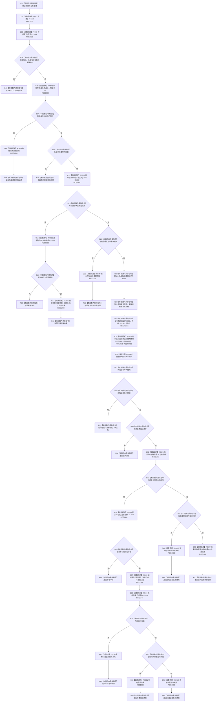

# CF-L8-0097 已有场景创建并接纳实际存在现状流程图

图类型：现状流程图
代码版本：`03a8b7ac099ccea83e57f2696e2290b7bcdfacaf`
当前工作区复核基线：`f19e4b0e001554d25b1cf0847dbcfb0b52d4e22c`
源码 blob：`524922ab2f3d0d76cfed4bdd517f0d7d57e1ae6a`
覆盖文件：`海中鱼巣/领域/数据操作.存在场景.ixx:345-410`
唯一根函数：R0652
完整签名：`海中鱼巣::存在场景业务结果 海中鱼巣::存在场景数据操作::在已有场景中创建并接纳实际存在(海中鱼巣::节点句柄 场景, std::uint64_t 存在主键) const`
参数：`场景`、`存在主键` 按值输入；要求有效场景句柄和非0主键
返回结果：入口、类型、读取失败、幂等冲突、事务提交、版本漂移、幂等读回、补建归属或结构失败的具名业务结果
调用图：`流程图/主程序可达调用关系/01_main可达项目调用边表.md`
输入契约 / 调用语境表：本图“当前边界”节；未另建独立表
非成功返回二分审查表：本图返回节点与“当前边界”节；未另建独立表
偏差清单：无 / 不适用；本图只登记当前实现事实
依据提交 / 结构化消息：源码冻结 `03a8b7ac099ccea83e57f2696e2290b7bcdfacaf`；无结构化执行消息
验证输出：配对逐行映射、节点集合、源码 blob 与本批机械审计
已登记调用方：R0643（RCE1884）
直接项目函数：F0442、F0163、R0648、R0629、R0626、R0635、R0651、R0116、R0649、R0644、R0639（RCE1927—RCE1934、RCE1946—RCE1948）
回调边界：RCB0029 注册 R0656；R0116 经 RCE1935 同步调度 R0656，本图不展开 R0656 正文
外部边界：X02340—X02342
逐行映射表：`流程图/代码流程图/L8/CF-L8-0097_已有场景创建并接纳实际存在_逐行代码映射表.md`
结构读写：写前读取场景和主键身份；R0116 同步执行 R0656 原子创建主信息、存在节点、主键绑定及归属关系；未提交时执行写后身份和归属读回
不得作为施工许可：是
不得宣称：请求提交必然成功，或端到端创建接纳能力已经验收

## 流程图

## 当前边界

- 366—387 行 lambda 是独立身份 R0656；根图只记录注册、同步调度、结构结果和生命周期。
- 写前已有实际存在时直接委托 R0651 建立归属；事务未提交后的同身份读回也可能再次委托 R0651 补建归属。
