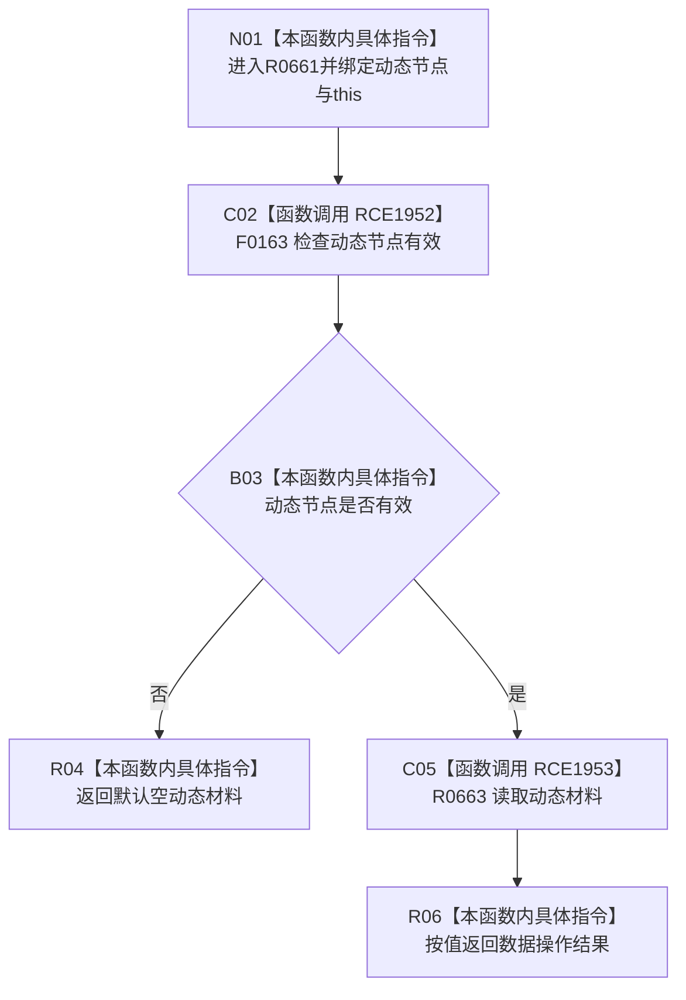

# CF-L8-0098 动态业务服务读取动态材料现状流程图

图类型：现状流程图
代码版本：`03a8b7ac099ccea83e57f2696e2290b7bcdfacaf`
当前工作区复核基线：`f19e4b0e001554d25b1cf0847dbcfb0b52d4e22c`
源码 blob：`23dc70065c2b5f1de58cb44e3e1de1294e7cf1eb`
覆盖文件：`海中鱼巣/领域/服务.动态.ixx:61-64`
唯一根函数：R0661
完整签名：`海中鱼巣::动态值式材料 海中鱼巣::动态业务服务::读取动态材料(海中鱼巣::节点句柄 动态节点) const`
参数：`动态节点` 按值传入；隐式 `this` 为非拥有只读借用
返回结果：动态节点无效时返回默认空材料；有效时返回数据操作读取结果
已登记调用方：R0680（RCE2024）
直接项目函数：F0163（RCE1952）、R0663（RCE1953）
外部边界：无
逐行映射表：`流程图/代码流程图/L8/CF-L8-0098_动态业务服务读取动态材料_逐行代码映射表.md`
调用图：`流程图/主程序可达调用关系/01_main可达项目调用边表.md`；入边 RCE2024，出边 RCE1952、RCE1953
输入契约 / 调用语境表：本图参数、返回结果和“当前边界”内嵌审查；无独立文件
非成功返回二分审查表：本图逻辑内返回和“当前边界”内嵌审查；无独立文件
偏差清单：本函数当前代码事实未发现需单列偏差；无独立文件
依据提交 / 结构化消息：冻结代码提交 `03a8b7ac099ccea83e57f2696e2290b7bcdfacaf`；流程图维护切片复核基线 `f19e4b0e001554d25b1cf0847dbcfb0b52d4e22c`
验证输出：逐行覆盖、Mermaid/节点集合与未跟踪文件差异检查通过；`check_specs.py --strict` 为 108/108 PASS
结构读写：服务层只做入口检查并委托只读数据操作
逻辑内返回：无效节点返回默认空材料
内部错误：本函数不重解释数据操作返回状态
生命周期与资源释放：返回材料按值传递，无资源获取
不得作为施工许可：是
不得宣称：非空材料等于动态结构完整；完整性由被调数据操作结果字段表达

## 流程图

## 当前边界

- 服务层拒绝无效句柄，不取得许可，也不读取仓库。
- 有效句柄路径直接透传 R0663 结果，不把未找到、许可拒绝等状态改写为成功。
