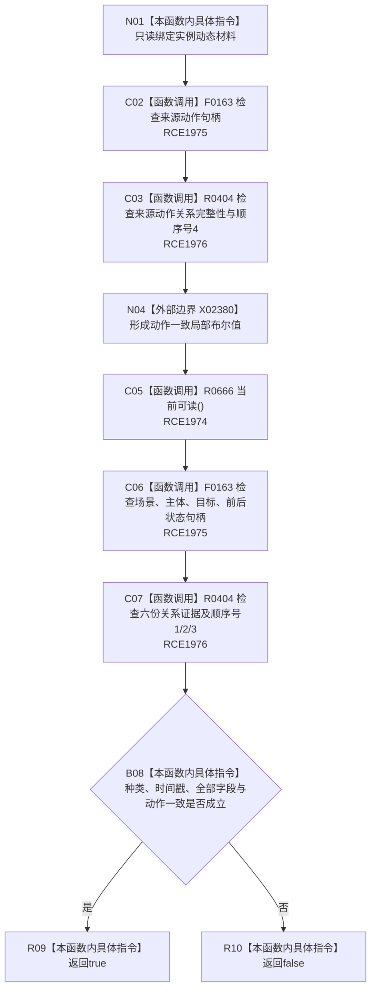

# CF-L8-0099 动态值式材料完整实例动态现状流程图

图类型：现状流程图
代码版本：`03a8b7ac099ccea83e57f2696e2290b7bcdfacaf`
当前工作区复核基线：`f19e4b0e001554d25b1cf0847dbcfb0b52d4e22c`
源码 blob：`cc399ea69282bf3ae0b0d59c7f0b587e5164b187`
覆盖文件：`海中鱼巣/领域/数据操作.状态动态.ixx:165-177`
唯一根函数：R0667
完整签名：`bool 海中鱼巣::动态值式材料::完整实例动态() const noexcept`
参数：无显式参数；只读动态材料全部实例字段与关系证据
返回结果：来源动作/关系一致且全部实例动态字段和顺序号完整时返回 `true`
已登记调用方：R0669（RCE2026）
直接项目函数：R0666（RCE1974）、F0163（RCE1975）、R0404（RCE1976）
外部边界：X02380（聚合布尔短路与局部生命周期）
调用图：`流程图/主程序可达调用关系/00_main可达函数身份表.md`、`01_main可达项目调用边表.md`、`02_main可达外部边界表.md`
逐行映射表：`流程图/代码流程图/L8/CF-L8-0099_动态值式材料完整实例动态_逐行代码映射表.md`
输入契约 / 调用语境表：本图内嵌审查；无独立文件
非成功返回二分审查表：本图内嵌审查；`false` 表示当前值式材料未满足完整实例动态分类
偏差清单：无独立文件；本批只记录当前代码事实
依据提交 / 结构化消息：冻结源码提交 `03a8b7ac099ccea83e57f2696e2290b7bcdfacaf` 与正式稳定边表
验证输出：Mermaid / 节点集合 / 逐行覆盖 PASS；目标 no-index 与全仓 diff 检查 PASS；strict 108/108 PASS；未构建、未运行
不得作为施工许可：是
不得宣称：完整材料对应的权威关系仍当前有效

## 流程图

## 当前边界

- 来源动作为空时要求来源动作关系也不完整；非空时要求关系完整且顺序号为4。
