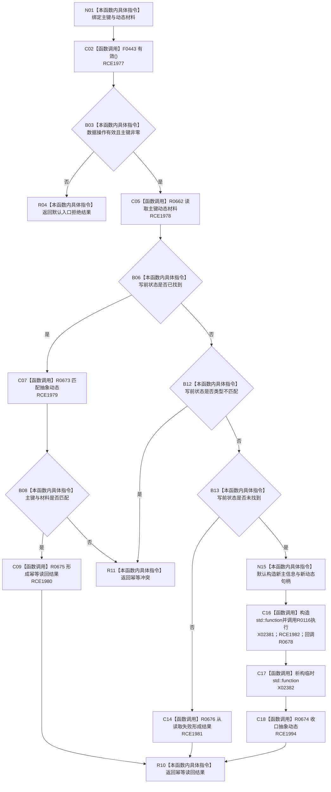

# CF-L8-0100 创建抽象动态现状流程图

图类型：现状流程图
代码版本：`03a8b7ac099ccea83e57f2696e2290b7bcdfacaf`
当前工作区复核基线：`f19e4b0e001554d25b1cf0847dbcfb0b52d4e22c`
源码 blob：`cc399ea69282bf3ae0b0d59c7f0b587e5164b187`
覆盖文件：`海中鱼巣/领域/数据操作.状态动态.ixx:516-548`
唯一根函数：R0668
完整签名：`海中鱼巣::状态动态业务结果 海中鱼巣::状态动态数据操作::创建抽象动态(std::uint64_t 主键, std::int64_t 动态材料) const`
参数：`主键`、`动态材料` 均按值输入；`主键 == 0` 被入口拒绝
返回结果：入口拒绝、幂等读回、幂等冲突、读取失败映射结果，或结构写入后的收口结果
已登记调用方：R0657（直接调用 R0668）
直接项目函数：F0443（RCE1977）、R0662（RCE1978）、R0673（RCE1979）、R0675（RCE1980）、R0676（RCE1981）、R0116（RCE1982）、R0674（RCE1994）
回调边界：R0116 执行期间经 RCE1983 调用独立根函数 R0678；R0678 正文不并入本图
外部边界：X02381（构造 `std::function`）、X02382（析构 `std::function`）
调用图：`流程图/主程序可达调用关系/00_main可达函数身份表.md`、`01_main可达项目调用边表.md`、`02_main可达外部边界表.md`
逐行映射表：`流程图/代码流程图/L8/CF-L8-0100_创建抽象动态_逐行代码映射表.md`
输入契约 / 调用语境表：本图内嵌审查；无独立文件
非成功返回二分审查表：本图内嵌审查；入口拒绝、幂等冲突与读取状态映射按当前代码分账
偏差清单：无独立文件；本批只记录当前代码事实
依据提交 / 结构化消息：冻结源码提交 `03a8b7ac099ccea83e57f2696e2290b7bcdfacaf` 与正式稳定边表
验证输出：Mermaid / 节点集合 / 逐行覆盖 PASS；目标 no-index 与全仓 diff 检查 PASS；strict 108/108 PASS；未构建、未运行
不得作为施工许可：是
不得宣称：执行器返回、请求提交或收口结果已经通过构建、运行或集成验收

## 流程图

## 当前边界

- 531—546 行中的 lambda 正文属于独立函数 R0678；本图只表达 R0668 构造闭包、把闭包交给 R0116、接收结构结果并收口。
- 本函数只有在写前状态为 `未找到` 时进入写入执行器；已有相同材料走幂等读回，已有不相同材料或类型不匹配走幂等冲突。
