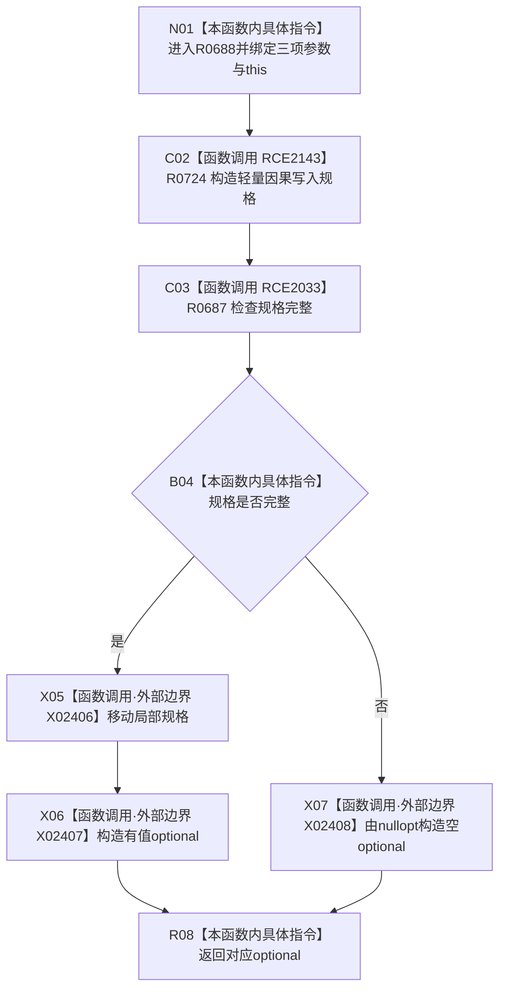

# CF-L8-0101 形成轻量因果写入规格现状流程图

图类型：现状流程图
代码版本：`03a8b7ac099ccea83e57f2696e2290b7bcdfacaf`
工作区复核基线：`9128ad4375a977d2744b00fcd6f9788d73b4aa7d`
源码 blob：`fdc9a1b062b28feffec733dd1a0e342812ef1ddc`
覆盖文件：`海中鱼巣/领域/数据操作.轻量因果.ixx:108-116`
唯一根函数：R0688
完整签名：`std::optional<海中鱼巣::轻量因果写入规格> 海中鱼巣::轻量因果数据操作::形成轻量因果写入规格(std::uint64_t 幂等主键, 海中鱼巣::节点句柄 来源动态, 海中鱼巣::主信息句柄 来源主信息) const`
参数：三项按值传入；隐式 `this` 为非拥有只读借用
返回结果：构造规格并检查完整；完整时移动进有值 optional，否则返回 `std::nullopt`
调用图：项目边表与外部边界表；入边 RCE2027，出边 RCE2033、RCE2143，外部 X02406—X02408
逐行映射表：`流程图/代码流程图/L8/CF-L8-0101_形成轻量因果写入规格_逐行代码映射表.md`
输入契约 / 调用语境表：参数与规格完整检查内嵌；无独立文件
非成功返回二分审查表：不完整返回空 optional；无独立文件
偏差清单：无独立偏差项
依据提交 / 结构化消息：冻结代码 `03a8b7ac…`；复核基线 `9128ad43…`
验证输出：逐行覆盖、Mermaid/节点集合、稳定 ID、无 HTML 与差异格式检查均通过；strict 108/108 PASS
不得作为施工许可：是
不得宣称：形成规格等于结构已写入或来源已读回
结构读写：仅构造局部规格与返回 optional
逻辑内返回：不完整时空 optional
内部错误：无独立内部错误分支
生命周期与资源释放：局部规格被移动或平凡释放

## 流程图

## 当前边界

- 即使规格不完整，构造函数 R0724 仍已先执行；失败只影响返回 optional。
