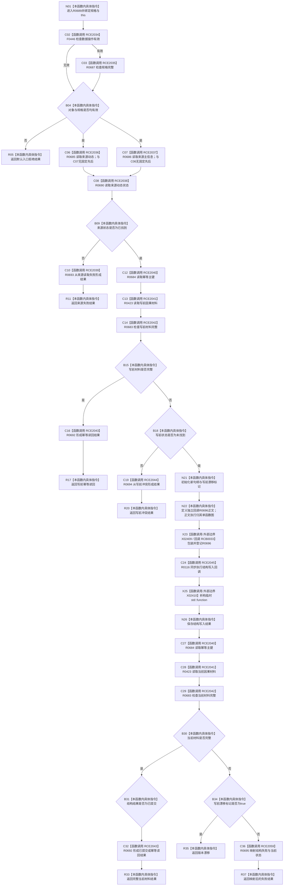

# CF-L8-0102 创建轻量因果现状流程图

图类型：现状流程图
代码版本：`03a8b7ac099ccea83e57f2696e2290b7bcdfacaf`
工作区复核基线：`9128ad4375a977d2744b00fcd6f9788d73b4aa7d`
源码 blob：`fdc9a1b062b28feffec733dd1a0e342812ef1ddc`
覆盖文件：`海中鱼巣/领域/数据操作.轻量因果.ixx:134-178`
唯一根函数：R0689
完整签名：`海中鱼巣::轻量因果业务结果 海中鱼巣::轻量因果数据操作::创建轻量因果(const 海中鱼巣::轻量因果写入规格& 规格) const`
参数：`规格` 为调用期间有效的非拥有只读借用；隐式 `this` 为非拥有只读借用
返回结果：入口无效返回默认结果；来源读取失败按读取状态映射；写前已有完整材料返回幂等读回；其它非未找到写前状态映射冲突；执行写入后按当前完整读回形成已提交或幂等读回，来源漂移返回版本漂移，否则映射结构失败
调用图：项目边表、外部边界表与回调登记；入边 RCE2028，出边 RCE2034—RCE2045、RCE2059，回调 RCB0033→R0696，外部 X02409、X02410
逐行映射表：`流程图/代码流程图/L8/CF-L8-0102_创建轻量因果_逐行代码映射表.md`
输入契约 / 调用语境表：入口、来源状态、写前状态和写后读回在本图内嵌审查；无独立文件
非成功返回二分审查表：入口拒绝、读取失败、冲突、版本漂移与结构失败均内嵌；无独立文件
偏差清单：当前代码事实未发现需单列偏差；无独立文件
依据提交 / 结构化消息：冻结代码提交 `03a8b7ac099ccea83e57f2696e2290b7bcdfacaf`；维护切片复核基线 `9128ad4375a977d2744b00fcd6f9788d73b4aa7d`
验证输出：逐行覆盖、Mermaid/节点集合、稳定 ID、无 HTML 与差异格式检查均通过；strict 108/108 PASS
不得作为施工许可：是
不得宣称：请求提交等于实际提交，或 R0689 直接执行了 R0696 正文中的候选写入调用
结构读写：通过 R0116 同步调度 R0696 回调执行结构写入；根函数本身只组织输入检查、写前/写后读取和结果映射
逻辑内返回：入口拒绝、幂等读回、读取失败映射、读取冲突映射与版本漂移
内部错误：写后无完整材料且非来源漂移时由 R0695 映射结构失败
生命周期与资源释放：具名 lambda 被包装为临时 `std::function`，执行表达式结束后经 X02410 析构

## 流程图

## 当前边界

- 第 136—137 行两个规格访问器是同一 R0690 调用的实参，求值先后未规定；双入边不表示并行执行。
- 第 147—166 行在 R0689 中形成、包装和同步调度回调；候选创建、绑定、读回与请求提交属于独立函数 R0696，不在本图重复展开。
- 写后当前材料完整时，结构结果已提交映射为已提交，其它结构状态映射为幂等读回；图不把请求提交直接写成已提交。
