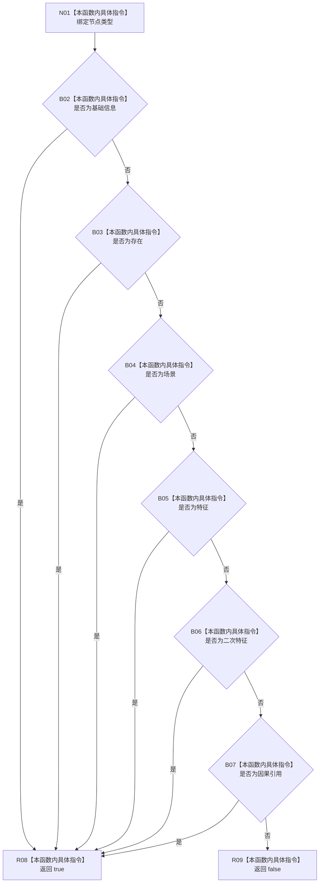

# CF-L8-0103 允许长期组成项现状流程图

图类型：现状流程图
代码版本：`03a8b7ac099ccea83e57f2696e2290b7bcdfacaf`
当前工作区复核基线：`b8a49bcb141d4fb8940225954dc328e54600030b`
源码 blob：`bf7807b3aedfa3586c4cd5f1be0ae23abe9fe35b`
覆盖文件：`海中鱼巣/领域/服务.二次特征.ixx:51-55`
唯一根函数：R0698
完整签名：`static bool 海中鱼巣::二次特征业务服务::允许长期组成项(海中鱼巣::节点类型 类型) noexcept`
参数：`类型` 按值输入
返回结果：基础信息、存在、场景、特征、二次特征或因果引用返回 true，其它类型返回 false
调用图：`流程图/主程序可达调用关系/01_main可达项目调用边表.md`
逐行映射表：`流程图/代码流程图/L8/CF-L8-0103_允许长期组成项_逐行代码映射表.md`
输入契约 / 调用语境表：本图“当前边界”节；未另建独立表
非成功返回二分审查表：false 表示类型不在服务入口允许集合，由 R0697 收口为入口拒绝
偏差清单：无 / 不适用；本图只登记当前实现事实
依据提交 / 结构化消息：源码冻结 `03a8b7ac099ccea83e57f2696e2290b7bcdfacaf`；无结构化执行消息
验证输出：配对逐行映射、节点集合、源码 blob 与本批机械审计
已登记调用方：R0697（RCE2074）
直接项目函数：无
外部边界：无
结构读写：无；只对节点类型枚举做纯判断
不得作为施工许可：是
不得宣称：允许类型已经具备完整二次特征结构，或该谓词已经过运行验证

## 流程图

## 当前边界

- R0697 在逐项身份读取成功后调用本函数，false 只裁决节点类型不属于长期组成项集合。
- 本函数不读取节点内容、关系或生命周期状态。
