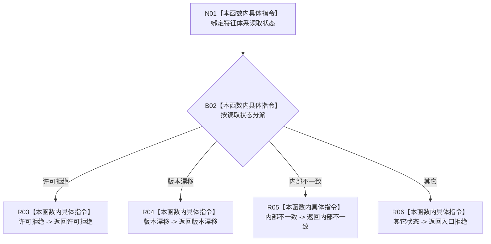

# CF-L8-0104 映射读取失败现状流程图

图类型：现状流程图
代码版本：`03a8b7ac099ccea83e57f2696e2290b7bcdfacaf`
当前工作区复核基线：`b8a49bcb141d4fb8940225954dc328e54600030b`
源码 blob：`bf7807b3aedfa3586c4cd5f1be0ae23abe9fe35b`
覆盖文件：`海中鱼巣/领域/服务.二次特征.ixx:57-68`
唯一根函数：R0699
完整签名：`static 海中鱼巣::特征体系业务结果 海中鱼巣::二次特征业务服务::映射读取失败(海中鱼巣::特征体系读取状态 状态) noexcept`
参数：`状态` 按值输入，表示组成项身份读取状态
返回结果：许可拒绝、版本漂移、内部不一致保持同类业务状态；其它状态统一返回入口拒绝
调用图：`流程图/主程序可达调用关系/01_main可达项目调用边表.md`
逐行映射表：`流程图/代码流程图/L8/CF-L8-0104_映射读取失败_逐行代码映射表.md`
输入契约 / 调用语境表：本图“当前边界”节；未另建独立表
非成功返回二分审查表：内部不一致属于追根因解决；其余状态按当前服务入口结果传播
偏差清单：无 / 不适用；本图只登记当前实现事实
依据提交 / 结构化消息：源码冻结 `03a8b7ac099ccea83e57f2696e2290b7bcdfacaf`；无结构化执行消息
验证输出：配对逐行映射、节点集合、源码 blob 与本批机械审计
已登记调用方：R0697（RCE2073）
直接项目函数：无
外部边界：无
结构读写：无；只映射读取状态枚举
不得作为施工许可：是
不得宣称：默认分支只可能接收某一具名状态，或根因已经验证

## 流程图

## 当前边界

- R0697 只在组成项身份非当前可读时调用本函数。
- 本函数不校验输入状态来源；默认分支将所有未列举状态统一降为入口拒绝。
