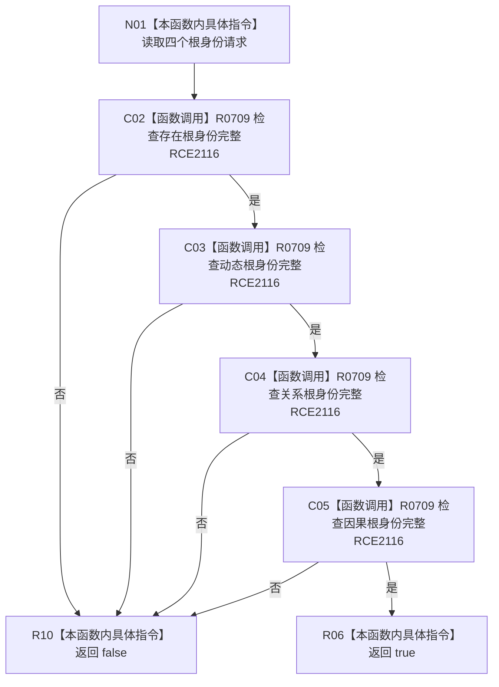

# CF-L8-0105 复核概念根角色请求完整现状流程图

图类型：现状流程图
代码版本：`03a8b7ac099ccea83e57f2696e2290b7bcdfacaf`
当前工作区复核基线：`b8a49bcb141d4fb8940225954dc328e54600030b`
源码 blob：`32e8a8739f139f19d1fdec4e79750b922cb8b15a`
覆盖文件：`海中鱼巣/领域/服务.概念图结构.ixx:30-33`
唯一根函数：R0710
完整签名：`bool 海中鱼巣::复核概念根角色请求::完整() const noexcept`
参数：无显式参数；只读当前请求中的存在根、动态根、关系根和因果根身份材料
返回结果：四个根身份请求都完整时返回 `true`；任一不完整时按短路返回 `false`
调用图：`流程图/主程序可达调用关系/00_main可达函数身份表.md`、`01_main可达项目调用边表.md`、`02_main可达外部边界表.md`
已登记调用方：R0711（RCE2117）
直接项目函数：R0709（RCE2116，四个字段调用点）
外部边界：无
逐行映射表：`流程图/代码流程图/L8/CF-L8-0105_复核概念根角色请求完整_逐行代码映射表.md`
输入契约 / 调用语境表：本图内嵌审查；由概念图结构业务服务在进入数据操作复核前调用
非成功返回二分审查表：本图内嵌审查；任一根身份材料不完整返回 `false`，属于写入前入口拒绝依据
偏差清单：无独立文件；本批只记录当前代码事实
依据提交 / 结构化消息：冻结源码提交 `03a8b7ac099ccea83e57f2696e2290b7bcdfacaf` 与正式稳定边表
验证输出：Mermaid / 节点集合 / 逐行覆盖 PASS；目标 no-index 与 strict 检查 PASS；未构建、未运行
不得作为施工许可：是
不得宣称：四个根的类别、稳定绑定或仓库当前性已经通过复核

## 流程图

## 当前边界

- 四次调用按 `&&` 从左到右短路；本函数不读取仓库或核对根类别。
