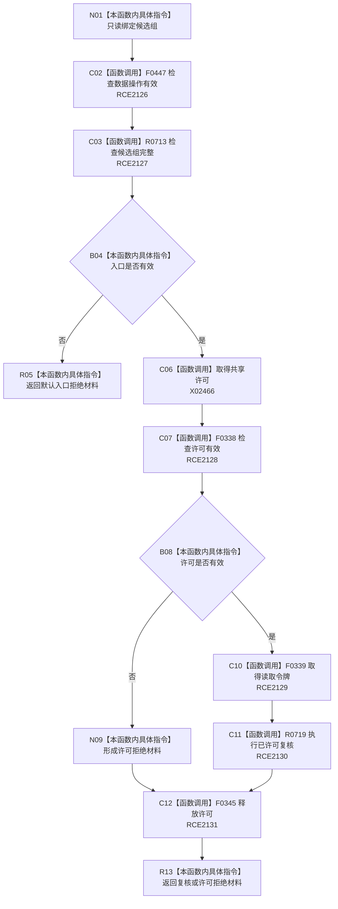

# CF-L8-0107 复核根角色组现状流程图

图类型：现状流程图
代码版本：`03a8b7ac099ccea83e57f2696e2290b7bcdfacaf`
当前工作区复核基线：`b8a49bcb141d4fb8940225954dc328e54600030b`
源码 blob：`ab7997e84df13fa2105b364f0fdb369d47d9c181`
覆盖文件：`海中鱼巣/领域/数据操作.概念图结构.ixx:272-277`
唯一根函数：R0717
完整签名：`海中鱼巣::概念根角色组值式材料 海中鱼巣::概念图结构数据操作::复核根角色组(const 海中鱼巣::概念根候选组& 候选组) const`
参数：`候选组` 只读借用
返回结果：入口拒绝默认材料、许可拒绝材料，或 R0719 的已许可复核结果
调用图：`流程图/主程序可达调用关系/00_main可达函数身份表.md`、`01_main可达项目调用边表.md`、`02_main可达外部边界表.md`
已登记调用方：R0711
直接项目函数：F0447（RCE2126）、R0713（RCE2127）、F0338（RCE2128）、F0339（RCE2129）、R0719（RCE2130）、F0345（RCE2131）
外部边界：X02466
逐行映射表：`流程图/代码流程图/L8/CF-L8-0107_复核根角色组_逐行代码映射表.md`
输入契约 / 调用语境表：本图内嵌审查；候选组须先满足值式完整性
非成功返回二分审查表：本图内嵌审查；入口无效为入口拒绝，许可无效为许可拒绝
偏差清单：无独立文件；本批只记录当前代码事实
依据提交 / 结构化消息：冻结源码提交 `03a8b7ac099ccea83e57f2696e2290b7bcdfacaf` 与正式稳定边表
验证输出：Mermaid / 节点集合 / 逐行覆盖 PASS；目标 no-index 与全仓 diff 检查 PASS；strict 108/108 PASS；未构建、未运行
不得作为施工许可：是
不得宣称：共享许可一定可取得或候选组复核成功

## 流程图

## 当前边界

- 许可在已构造后的所有返回路径经 F0345 析构；入口拒绝发生在取得许可之前。
