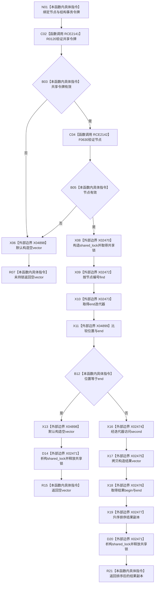

# CF-L8-0108 索引仓库读取节点主键组现状流程图

图类型：现状流程图
代码版本：`03a8b7ac099ccea83e57f2696e2290b7bcdfacaf`
当前工作区复核基线：`8632fb891fb3beea255aff1946c07b0fe975ef2b`
源码 blob：`8874312f67f19b220a08b1397c6103396878513d`
覆盖文件：`海中鱼巣/核心/索引仓库.cpp:214-224`
唯一根函数：R0723
完整签名：`std::vector<std::uint64_t> 海中鱼巣::索引仓库::读取节点主键组(海中鱼巣::节点句柄 节点, const 海中鱼巣::结构事务令牌& 令牌) const`
参数：`节点` 按值输入；`令牌` 为 const 非拥有借用
返回结果：共享令牌和节点均有效且存在绑定时，返回按升序排列的主键副本；否则返回空向量
调用图：`流程图/主程序可达调用关系/01_main可达项目调用边表.md`
逐行映射表：`流程图/代码流程图/L8/CF-L8-0108_索引仓库读取节点主键组_逐行代码映射表.md`
输入契约 / 调用语境表：本图“当前边界”节；未另建独立表
非成功返回二分审查表：无效令牌、无效节点或未找到绑定均为逻辑内空结果；本函数没有内部错误返回通道
偏差清单：无 / 不适用；本图只登记当前实现事实
依据提交 / 结构化消息：源码冻结 `03a8b7ac099ccea83e57f2696e2290b7bcdfacaf`；无结构化执行消息
验证输出：配对逐行映射、节点集合、源码 blob 与本批机械审计
已登记调用方：R0669（RCE1996）、R0720（RCE2138）、R0063（RCE2156）、R0033（RCE2157）、R0347（RCE2158）、R0396（RCE2159）、R0422（RCE2160）、R0413（RCE2161）、R0424（RCE2162）、R0435（RCE2163）、R0773（RCE2648）
直接项目函数：RCE2141→R0120；RCE2142→F0630
外部边界：X02470、X02471、X02472、X02473、X02474、X02475、X02476、X02477、X04898、X04899
结构读写：持共享锁读取 `节点主键组_`；返回副本排序，不修改仓库内映射
不得作为施工许可：是
不得宣称：空结果能够区分令牌无效、节点无效或未找到绑定，或仓库中的原始主键组已经排序

## 流程图

## 当前边界

- 第217行使用短路求值：只有 R0120 返回真时才调用 F0630；任一校验失败时尚未构造共享锁。
- 未找到绑定时已经持有共享锁，空向量构造完成后必须先经 X02471 释放共享锁再返回。
- 排序只作用于从仓库映射拷贝出的结果副本；本图不登记 NRVO、返回移动或结果向量析构候选。
