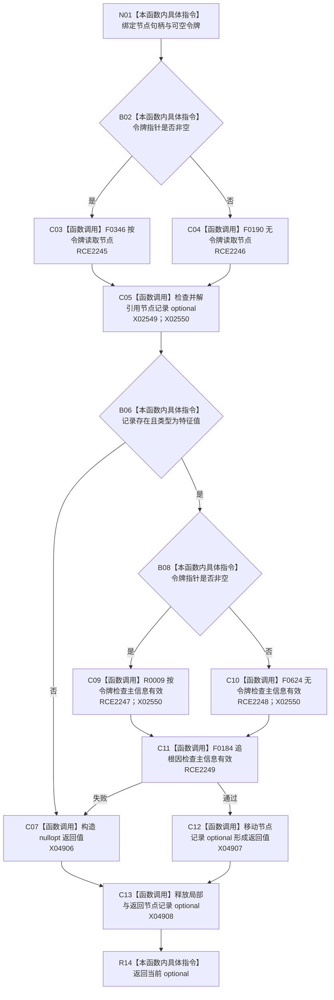

# CF-L8-0109 读取有效特征值节点现状流程图

图类型：现状流程图
代码版本：`03a8b7ac099ccea83e57f2696e2290b7bcdfacaf`
当前工作区复核基线：`8632fb891fb3beea255aff1946c07b0fe975ef2b`
源码 blob：`be8c82c78253b3bc7d3f4aa15a93660e0025bb06`
覆盖文件：`海中鱼巣/领域/特征值服务.h:597-613`
唯一根函数：R0731
完整签名：`std::optional<海中鱼巣::节点记录> 海中鱼巣::特征值服务::读取有效特征值节点(海中鱼巣::节点句柄 特征值节点, const 海中鱼巣::结构事务令牌* 令牌 = nullptr) const`
参数：`特征值节点` 按值传入；`令牌` 为可空、非拥有只读指针；只读节点和主信息仓库
返回结果：节点存在、类型为特征值且主信息有效时返回节点记录 optional；否则返回 `std::nullopt`
调用图：`流程图/主程序可达调用关系/00_main可达函数身份表.md`、`01_main可达项目调用边表.md`、`02_main可达外部边界表.md`
已登记调用方：R0730（RCE2242）、R0864（RCE3179）、R0865（RCE3190）、R0866（RCE3198）、R0867（RCE3209）、R0888（RCE3293）
直接项目函数：F0346（RCE2245）、F0190（RCE2246）、R0009（RCE2247）、F0624（RCE2248）、F0184（RCE2249）
外部边界：X02549、X02550、X04906—X04908
逐行映射表：`流程图/代码流程图/L8/CF-L8-0109_读取有效特征值节点_逐行代码映射表.md`
输入契约 / 调用语境表：本图内嵌审查；调用方按当前许可语境传入令牌或空指针
非成功返回二分审查表：节点缺失/类型不匹配折叠为空 optional；主信息失效先触发追根因检查再返回空
偏差清单：补登记 X04906—X04908；本图只记录当前实现折叠口径
依据提交 / 结构化消息：冻结源码提交 `03a8b7ac099ccea83e57f2696e2290b7bcdfacaf`、正式稳定边表及顶层稳定 ID 裁决
验证输出：Mermaid / 节点集合 / 逐行覆盖 PASS；目标 no-index 与 strict 检查 PASS；未构建、未运行
不得作为施工许可：是
不得宣称：空 optional 能区分节点不存在、类型错误和主信息失效

## 流程图

## 当前边界

- 令牌只决定仓库读取重载，不改变节点和主信息的准入条件。
- 主信息失效被视为内部不一致诊断，但仍折叠为空 optional 返回。
