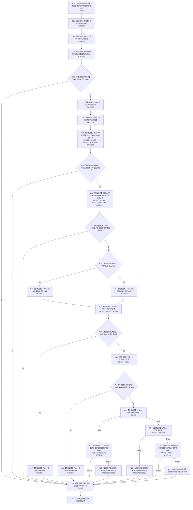

# CF-L8-0110 读取原始值状态已加锁现状流程图

图类型：现状流程图
代码版本：`03a8b7ac099ccea83e57f2696e2290b7bcdfacaf`
当前工作区复核基线：`8632fb891fb3beea255aff1946c07b0fe975ef2b`
源码 blob：`be8c82c78253b3bc7d3f4aa15a93660e0025bb06`
覆盖文件：`海中鱼巣/领域/特征值服务.h:615-671`
唯一根函数：R0732
完整签名：`海中鱼巣::特征值服务::原始值状态 海中鱼巣::特征值服务::读取原始值状态_已加锁(海中鱼巣::节点句柄 特征值节点, 海中鱼巣::主信息句柄 主信息句柄值, const 海中鱼巣::结构事务令牌* 令牌 = nullptr) const`
参数：`特征值节点`、`主信息句柄值` 按值传入；`令牌` 为可空非拥有只读指针；调用方必须已经持有原始值锁
返回结果：结构一致时返回标记 `内部一致=true` 的 I64、Vec 或无原始值状态；任何重复、残留或类型冲突时返回默认不一致状态
调用图：`流程图/主程序可达调用关系/00_main可达函数身份表.md`、`01_main可达项目调用边表.md`、`02_main可达外部边界表.md`
已登记调用方：R0730（RCE2243）、R0864（RCE3181）、R0865（RCE3191）、R0866（RCE3200）、R0867（RCE3210）、R0888（RCE3294）
直接项目函数：R0554（RCE2250）、R0556（RCE2251）、F0184（RCE2252）、R0548（RCE2253）、R0552（RCE2254）、R0544（RCE2255）、R0545（RCE2256）、F0383（RCE2257）、F0619（RCE2258）
外部边界：X02551—X02560、X04909、X04910
逐行映射表：`流程图/代码流程图/L8/CF-L8-0110_读取原始值状态已加锁_逐行代码映射表.md`
输入契约 / 调用语境表：本图内嵌审查；上游已经准入特征值节点并持有原始值共享锁或独占锁
非成功返回二分审查表：全部中途默认状态返回均由结构重复、记录不一致、多类型并存或版本残留触发，固定为追根因解决
偏差清单：补登记 X04909、X04910；本图不裁决当前折叠状态是否需要改造
依据提交 / 结构化消息：冻结源码提交 `03a8b7ac099ccea83e57f2696e2290b7bcdfacaf`、正式稳定边表及顶层稳定 ID 裁决
验证输出：Mermaid / 节点集合 / 逐行覆盖 PASS；目标 no-index 与 strict 检查 PASS；未构建、未运行
不得作为施工许可：是
不得宣称：内部一致状态已经经过并发运行验证，或默认结果能区分具体内部不一致原因

## 流程图

## 当前边界

- 本函数假定原始值表锁已由调用方持有；函数名中的“已加锁”不是本函数取得锁的动作。
- `结果.内部一致=true` 只证明当前静态分支未发现表内冲突，不证明业务值适用或调用方输入正确。
