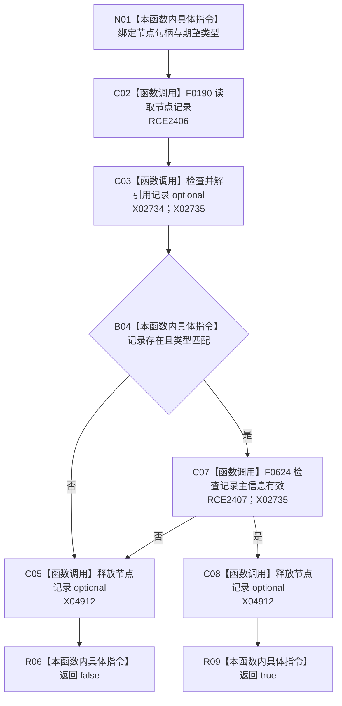

# CF-L8-0113 世界树初始化服务节点类型匹配现状流程图

图类型：现状流程图
代码版本：`03a8b7ac099ccea83e57f2696e2290b7bcdfacaf`
当前工作区复核基线：`8632fb891fb3beea255aff1946c07b0fe975ef2b`
源码 blob：`77edcb28282c0ec33e7c695e063b1605e4fb37bf`
覆盖文件：`海中鱼巣/领域/初始化.世界树.ixx:121-124`
唯一根函数：R0735
完整签名：`bool 海中鱼巣::世界树初始化服务::节点类型匹配(海中鱼巣::节点句柄 节点值, 海中鱼巣::节点类型 类型) const`
参数：`节点值`、`类型` 按值传入；只读初始化服务持有的节点和主信息仓库
返回结果：节点记录存在、类型匹配且主信息有效时返回 `true`，否则返回 `false`
调用图：`流程图/主程序可达调用关系/00_main可达函数身份表.md`、`01_main可达项目调用边表.md`、`02_main可达外部边界表.md`
已登记调用方：F0635（RCE2396）
直接项目函数：F0190（RCE2406）、F0624（RCE2407）
外部边界：X02734、X02735、X04912
逐行映射表：`流程图/代码流程图/L8/CF-L8-0113_世界树初始化服务节点类型匹配_逐行代码映射表.md`
输入契约 / 调用语境表：本图内嵌审查；世界树初始化在三类根节点创建后检查根基础信息节点
非成功返回二分审查表：任一条件失败返回 `false`，用于触发初始化清理，属于初始化准入判断
偏差清单：补登记节点记录 optional 生命周期 X04912；无其它独立偏差文件
依据提交 / 结构化消息：冻结源码提交 `03a8b7ac099ccea83e57f2696e2290b7bcdfacaf`、正式稳定边表及顶层稳定 ID 裁决
验证输出：Mermaid / 节点集合 / 逐行覆盖 PASS；目标 no-index 与 strict 检查 PASS；未构建、未运行
不得作为施工许可：是
不得宣称：返回 true 证明节点承担完整世界树根业务合同

## 流程图

## 当前边界

- 本函数检查节点记录、精确类型与主信息有效性，不检查父子关系或世界树归属。
