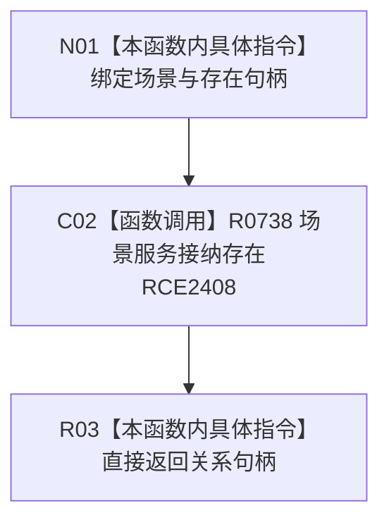

# CF-L8-0114 世界服务接纳存在现状流程图

图类型：现状流程图
代码版本：`03a8b7ac099ccea83e57f2696e2290b7bcdfacaf`
当前工作区复核基线：`8632fb891fb3beea255aff1946c07b0fe975ef2b`
源码 blob：`75494ac696f3fbe3223bb966dab6dee39e4c5409`
覆盖文件：`海中鱼巣/领域/世界服务.h:36-38`
唯一根函数：R0736
完整签名：`海中鱼巣::关系句柄 海中鱼巣::世界服务::接纳存在(海中鱼巣::节点句柄 场景, 海中鱼巣::节点句柄 存在)`
参数：`场景`、`存在` 均按值传入；使用世界服务持有的场景服务引用
返回结果：直接返回场景服务接纳存在所得关系句柄，包括无效关系句柄结果
调用图：`流程图/主程序可达调用关系/00_main可达函数身份表.md`、`01_main可达项目调用边表.md`、`02_main可达外部边界表.md`
已登记调用方：F0635（RCE2398）
直接项目函数：R0738（RCE2408）
外部边界：无
逐行映射表：`流程图/代码流程图/L8/CF-L8-0114_世界服务接纳存在_逐行代码映射表.md`
输入契约 / 调用语境表：本图内嵌审查；世界树初始化把已创建的自我所在场景与自我存在节点传入
非成功返回二分审查表：无独立分支；被调函数无效关系句柄原样向上传递
偏差清单：无独立文件；本批只记录当前委托事实
依据提交 / 结构化消息：冻结源码提交 `03a8b7ac099ccea83e57f2696e2290b7bcdfacaf` 与正式稳定边表
验证输出：Mermaid / 节点集合 / 逐行覆盖 PASS；目标 no-index 与 strict 检查 PASS；未构建、未运行
不得作为施工许可：是
不得宣称：场景和存在输入一定有效，或归属关系已经成功发布

## 流程图

## 当前边界

- 本函数只委托场景服务，不自行检查类型、创建关系或读回关系。
