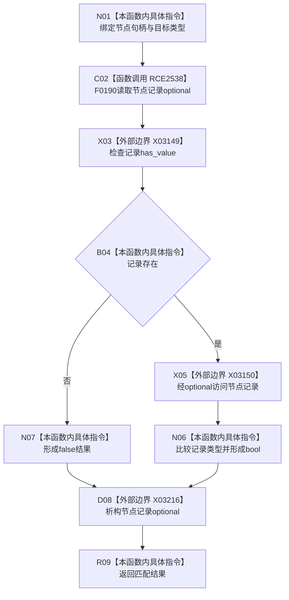

# CF-L8-0115 二次特征服务节点类型匹配现状流程图

图类型：现状流程图
代码版本：`03a8b7ac099ccea83e57f2696e2290b7bcdfacaf`
当前工作区复核基线：`ef4f7bda76c92c0eb11456cfa267d76f35810616`
源码 blob：`ef359c1ba720ed96a64c81ca3fca2cb42a0824bd`
覆盖文件：`海中鱼巣/领域/二次特征服务.h:177-180`
唯一根函数：R0751
完整签名：`bool 海中鱼巣::二次特征服务::节点类型匹配(海中鱼巣::节点句柄 节点句柄值, 海中鱼巣::节点类型 类型) const`
参数：`节点句柄值`、`类型` 按值输入；隐式 `this` 为只读二次特征服务借用
返回结果：节点记录存在且记录类型等于目标类型时返回 `true`，否则返回 `false`
调用图：`流程图/主程序可达调用关系/01_main可达项目调用边表.md`
逐行映射表：`流程图/代码流程图/L8/CF-L8-0115_二次特征服务节点类型匹配_逐行代码映射表.md`
输入契约 / 调用语境表：R0204 读取二次特征组成项前用本函数筛选二次特征节点身份
非成功返回二分审查表：记录不存在或类型不匹配均为逻辑内 `false`，不改变结构
偏差清单：无 / 不适用；本图只登记当前实现事实
依据提交 / 结构化消息：源码冻结 `03a8b7ac099ccea83e57f2696e2290b7bcdfacaf`；无结构化执行消息
验证输出：配对逐行映射、节点集合、源码 blob 与本批机械审计
已登记调用方：R0204（RCE2537）
直接项目函数：F0190（RCE2538）
外部边界：X03149、X03150、X03216
结构读写：只读节点仓库返回的节点记录副本，不修改节点或二次特征结构
不得作为施工许可：是
不得宣称：返回 `true` 已证明节点具备完整二次特征业务材料

## 流程图

## 当前边界

- 第179行使用短路合取；记录不存在时不会访问 optional 所含记录。
- X03216 在真假两条返回路径上统一表达局部 optional 生命周期结束。
