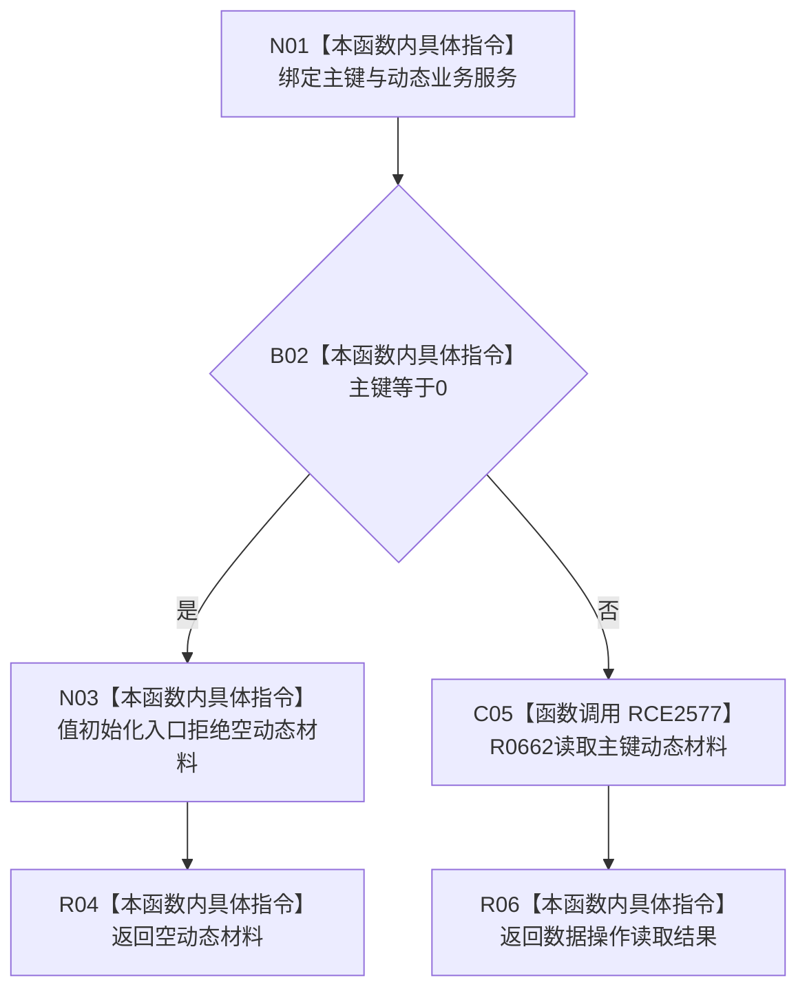

# CF-L8-0117 动态业务服务读取主键动态材料现状流程图

图类型：现状流程图
代码版本：`03a8b7ac099ccea83e57f2696e2290b7bcdfacaf`
当前工作区复核基线：`ef4f7bda76c92c0eb11456cfa267d76f35810616`
源码 blob：`23dc70065c2b5f1de58cb44e3e1de1294e7cf1eb`
覆盖文件：`海中鱼巣/领域/服务.动态.ixx:66-69`
唯一根函数：R0753
完整签名：`海中鱼巣::动态值式材料 海中鱼巣::动态业务服务::读取主键动态材料(std::uint64_t 主键) const`
参数：`主键` 按值输入；0 表示入口无效；隐式 `this` 为只读动态业务服务借用
返回结果：主键为0时返回入口拒绝状态的空动态材料；否则原样返回数据操作读取结果
调用图：`流程图/主程序可达调用关系/01_main可达项目调用边表.md`
逐行映射表：`流程图/代码流程图/L8/CF-L8-0117_动态业务服务读取主键动态材料_逐行代码映射表.md`
输入契约 / 调用语境表：R0232、R0236 以物理主键查询动态材料；本函数只在服务边界拒绝主键0
非成功返回二分审查表：主键0返回空材料是逻辑内入口拒绝；非零主键的读取状态由 R0662 形成并透传
偏差清单：无 / 不适用；本图只登记当前实现事实
依据提交 / 结构化消息：源码冻结 `03a8b7ac099ccea83e57f2696e2290b7bcdfacaf`；无结构化执行消息
验证输出：配对逐行映射、节点集合、源码 blob 与本批机械审计
已登记调用方：R0232（RCE2545）、R0236（RCE2555）
直接项目函数：R0662（RCE2577）
外部边界：无
结构读写：本函数不写结构；非零主键分支委托数据操作读取动态值式材料
不得作为施工许可：是
不得宣称：返回材料已构成完整动态，或空材料能够区分全部非成功状态

## 流程图

## 当前边界

- 第67行的 `{}` 是项目值式材料聚合值初始化，不产生具名项目函数或外部边界调用。
- 本函数不重新解释 R0662 返回材料中的读取状态或动态材料种类。
