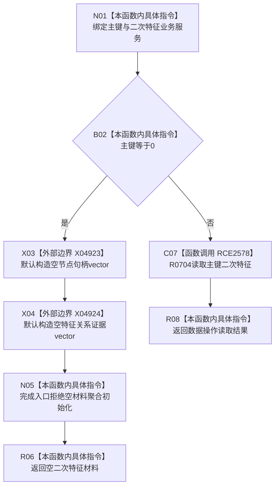

# CF-L8-0118 二次特征业务服务读取主键二次特征现状流程图

图类型：现状流程图
代码版本：`03a8b7ac099ccea83e57f2696e2290b7bcdfacaf`
当前工作区复核基线：`ef4f7bda76c92c0eb11456cfa267d76f35810616`
源码 blob：`bf7807b3aedfa3586c4cd5f1be0ae23abe9fe35b`
覆盖文件：`海中鱼巣/领域/服务.二次特征.ixx:45-48`
唯一根函数：R0754
完整签名：`海中鱼巣::二次特征值式材料 海中鱼巣::二次特征业务服务::读取主键二次特征(std::uint64_t 主键) const`
参数：`主键` 按值输入；0 表示入口无效；隐式 `this` 为只读二次特征业务服务借用
返回结果：主键为0时返回含两个空 vector 的入口拒绝二次特征材料；否则原样返回数据操作读取结果
调用图：`流程图/主程序可达调用关系/01_main可达项目调用边表.md`
逐行映射表：`流程图/代码流程图/L8/CF-L8-0118_二次特征业务服务读取主键二次特征_逐行代码映射表.md`
输入契约 / 调用语境表：R0232、R0236 以物理主键查询二次特征材料；本函数只在服务边界拒绝主键0
非成功返回二分审查表：主键0返回空材料是逻辑内入口拒绝；非零主键的读取状态由 R0704 形成并透传
偏差清单：无 / 不适用；本图只登记当前实现事实
依据提交 / 结构化消息：源码冻结 `03a8b7ac099ccea83e57f2696e2290b7bcdfacaf`；X04923、X04924 由顶层图谱维护收口裁决
验证输出：配对逐行映射、节点集合、源码 blob 与本批机械审计
已登记调用方：R0232（RCE2546）、R0236（RCE2556）
直接项目函数：R0704（RCE2578）
外部边界：X04923、X04924
结构读写：本函数不写结构；非零主键分支委托数据操作读取二次特征值式材料
不得作为施工许可：是
不得宣称：返回材料已完整，或两个空 vector 能够区分未找到与其它非成功状态

## 流程图

## 当前边界

- 第46行的 `{}` 聚合初始化调用两个 vector 默认构造；它不调用具名项目构造函数。
- 返回对象的析构发生在调用方所有的生命周期中，不登记为 R0754 的直接边界。
