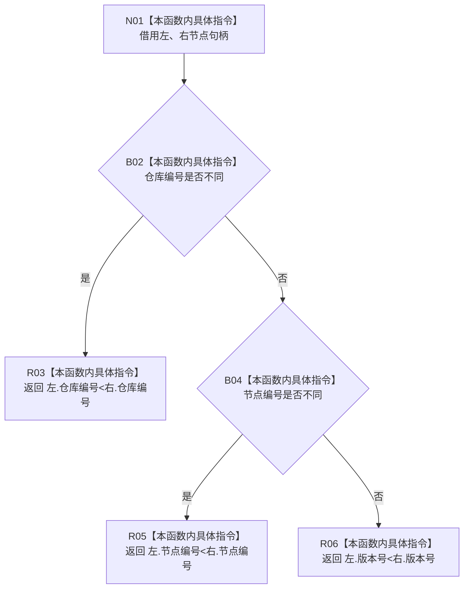

# CF-L8-0120 节点句柄小于现状流程图

图类型：现状流程图
代码版本：`03a8b7ac099ccea83e57f2696e2290b7bcdfacaf`
当前工作区复核基线：`9fda64b1f2330996913d09dd314fc498303d3e54`
源码 blob：`4c7bcd451f2e46e85d707a40c371dcbeaa2c1169`
覆盖文件：`海中鱼巣/领域/特征服务.h:1038-1046`
唯一根函数：R0780
完整签名：`static bool 海中鱼巣::特征服务::节点句柄小于(const 节点句柄& 左, const 节点句柄& 右)`
参数：`左`、`右` 均以 const 引用借用，只在调用期间读取
返回结果：按仓库编号、节点编号、版本号依次进行字典序比较，左侧首次不同字段较小时返回 `true`，否则返回 `false`
已登记调用方：R0777（RCE2661；RCB0035 `std::sort` 同步比较回调）
直接项目函数：无
外部边界：无
逐行映射表：`流程图/代码流程图/L8/CF-L8-0120_节点句柄小于_逐行代码映射表.md`
结构读写：只读两个节点句柄字段，不改变结构
不得作为施工许可：是
不得宣称：比较次序代表句柄有效性、创建时间或业务优先级

## 流程图

## 当前边界

- 三组比较均为整数内建运算，不建立项目函数调用边或外部边界。
- 本函数只提供严格字典序比较，不检查两个句柄是否相等或有效。
