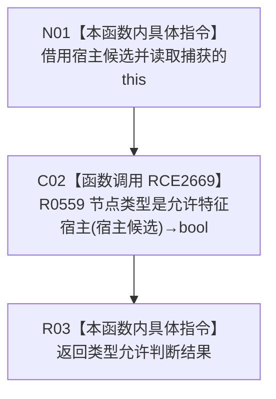

# CF-L8-0121 实例特征槽位宿主候选允许现状流程图

图类型：现状流程图
代码版本：`03a8b7ac099ccea83e57f2696e2290b7bcdfacaf`
当前工作区复核基线：`9fda64b1f2330996913d09dd314fc498303d3e54`
源码 blob：`4c7bcd451f2e46e85d707a40c371dcbeaa2c1169`
覆盖文件：`海中鱼巣/领域/特征服务.h:1273-1275`
唯一根函数：R0781
完整签名：`bool 海中鱼巣::特征服务::节点是实例特征槽位(节点句柄 槽位节点) const::<lambda@特征服务.h:1273>::operator()(const 海中鱼巣::节点句柄& 宿主候选) const`
参数：`宿主候选` 由 `std::any_of` 以 const 引用传入；lambda 通过捕获的 `this` 借用特征服务
返回结果：直接返回 R0559 对宿主候选类型是否允许的判断结果
已登记调用方：R0778（RCE2666；RCB0037 `std::any_of` 同步谓词回调）
直接项目函数：R0559（RCE2669）
外部边界：无
逐行映射表：`流程图/代码流程图/L8/CF-L8-0121_实例特征槽位宿主候选允许_逐行代码映射表.md`
结构读写：只读宿主候选类型，不改变结构
不得作为施工许可：是
不得宣称：返回 `true` 代表候选与槽位之间的归属关系当前完整

## 流程图

## 当前边界

- lambda 仅是 R0778 交给 `std::any_of` 的同步谓词；算法遍历与短路属于调用方流程。
- 本函数不读取槽位节点或关系记录。
