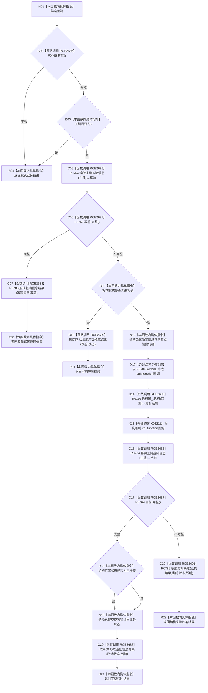

# CF-L8-0122 语素基础创建基础信息现状流程图

图类型：现状流程图
代码版本：`03a8b7ac099ccea83e57f2696e2290b7bcdfacaf`
当前工作区复核基线：`9fda64b1f2330996913d09dd314fc498303d3e54`
源码 blob：`ccde9a574e3817b75e3d02c9c8f88e244327c06a`
覆盖文件：`海中鱼巣/领域/数据操作.语素基础.ixx:332-354`
唯一根函数：R0783
完整签名：`语义基础业务结果 海中鱼巣::语素基础数据操作::创建基础信息(std::uint64_t 主键) const`
参数：`主键` 按值输入；0 为非法入口值
返回结果：无效入口返回默认结果；写前完整返回幂等读回；写前冲突返回冲突映射；执行写入后按当前读回形成已提交/幂等读回结果，无法完整读回时返回 R0789 的结构失败映射
已登记调用方：R0496（RCE2684）
直接项目函数：F0445、R0764、R0769、R0786、R0787、R0116、R0789（RCE2685—RCE2691）
回调：R0784（RCB0038；由 R0116 经 RCE2692 同步调用）
外部边界：X03210 `std::function<void(结构写入会话&)>::function(lambda)`；X03211 `~function()`
逐行映射表：`流程图/代码流程图/L8/CF-L8-0122_语素基础创建基础信息_逐行代码映射表.md`
结构读写：写前、写后各读取一次主键基础信息；中间由 R0116 调度回调在结构会话中创建并绑定基础信息节点
不得作为施工许可：是
不得宣称：回调请求提交必然使结构结果为已提交，或结构结果非已提交必然表示失败

## 流程图

## 当前边界

- X03210/X03211 只表示同步回调包装生命周期；R0784 的内部写入和请求提交保留在独立单函数图。
- 写后读回完整时，结构结果只有 `已提交` 映射为已提交业务状态，其余状态均映射为幂等读回；读回不完整才进入 R0789。
