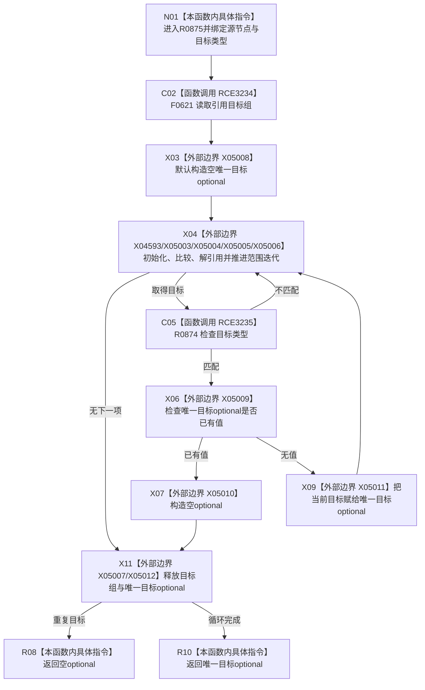

# CF-L8-0123 状态服务读取唯一引用目标现状流程图

图类型：现状流程图
代码版本：`03a8b7ac099ccea83e57f2696e2290b7bcdfacaf`
当前工作区复核基线：`00d917a5cf09998d2ab14d9239e1c194b5593ff0`
源码 blob：`5b6bb9defda124496de99899621a9e4ab2dac179`
覆盖文件：`海中鱼巣/领域/状态服务.h:317-330`
唯一根函数：R0875
完整签名：`std::optional<海中鱼巣::节点句柄> 海中鱼巣::状态服务::读取唯一引用目标(海中鱼巣::节点句柄 源节点, 海中鱼巣::节点类型 目标类型) const`
参数：源节点与目标类型按值；只读关系和节点仓库
返回结果：恰有一个目标类型匹配的引用目标时返回该句柄；无匹配或出现第二个匹配时返回空 optional
调用图：正式 main 可达关系表
已登记调用方：R0872（RCE3230）、R0873（RCE3232）
直接项目函数：F0621（RCE3234）、R0874（RCE3235）
外部边界：X04593、X05003—X05012
逐行映射表：`流程图/代码流程图/L8/CF-L8-0123_状态服务读取唯一引用目标_逐行代码映射表.md`
不得作为施工许可：是
不得宣称：无值可区分无目标与重复目标

## 流程图

## 当前边界

- 循环不在第二个匹配之外继续；首次匹配保存在局部 optional，无匹配时该 optional 保持空。
