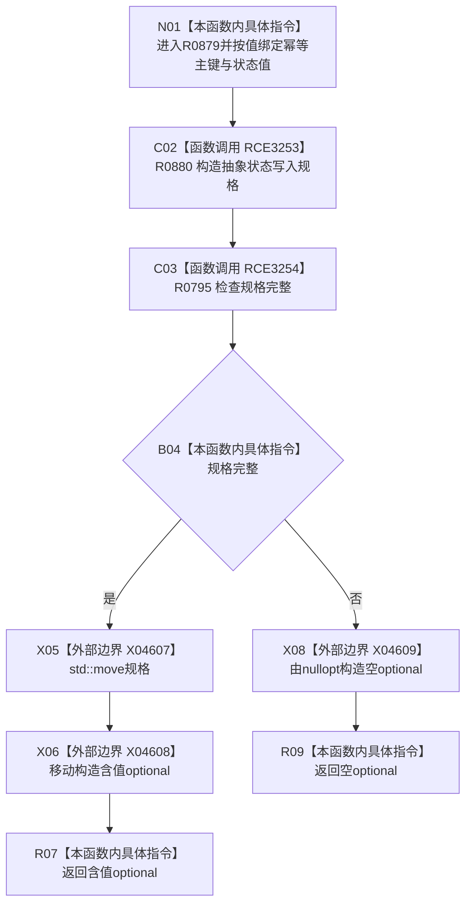

# CF-L8-0124 形成抽象状态写入规格现状流程图

图类型：现状流程图
代码版本：`03a8b7ac099ccea83e57f2696e2290b7bcdfacaf`
当前工作区复核基线：`00d917a5cf09998d2ab14d9239e1c194b5593ff0`
源码 blob：`cc399ea69282bf3ae0b0d59c7f0b587e5164b187`
覆盖文件：`海中鱼巣/领域/数据操作.状态动态.ixx:328-335`
唯一根函数：R0879
完整签名：`std::optional<海中鱼巣::抽象状态写入规格> 海中鱼巣::状态动态数据操作::形成抽象状态写入规格(std::uint64_t 幂等主键, std::int64_t 状态值) const`
参数：`幂等主键` 和 `状态值` 均按值传入
返回结果：幂等主键非零时返回含抽象状态写入规格的 optional，否则返回 nullopt
调用图：正式 main 可达关系表
已登记调用方：R0511（RCE3252）
直接项目函数：R0880（RCE3253）、R0795（RCE3254）
外部边界：X04607、X04608、X04609
逐行映射表：`流程图/代码流程图/L8/CF-L8-0124_形成抽象状态写入规格_逐行代码映射表.md`
输入契约 / 调用语境表：不适用；本批只维护当前代码图谱
非成功返回二分审查表：不适用；空 optional 只按当前入口分类标注
偏差清单：不适用；未在本图裁决规范偏差
依据提交 / 结构化消息：当前正式制图队列与三份 main 可达关系表
验证输出：328—335 行逐行覆盖；2 条项目边和 3 个外部边界可反查
不得作为施工许可：是
不得宣称：optional 含值证明状态已经写入或规格已被消费

## 流程图

## 当前边界

- `状态值` 不参与完整性判断；当前唯一准入条件是幂等主键非零。
