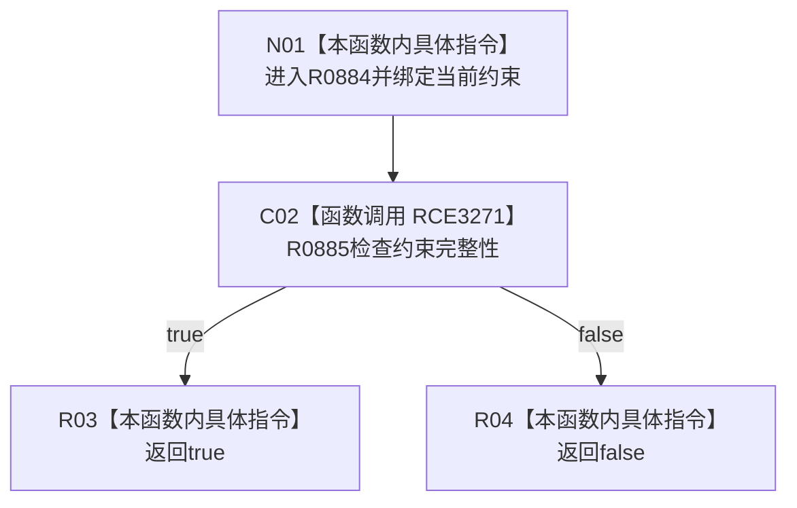

# CF-L8-0125 概念约束完整谓词现状流程图

图类型：现状流程图
代码版本：`03a8b7ac099ccea83e57f2696e2290b7bcdfacaf`
当前工作区复核基线：`00d917a5cf09998d2ab14d9239e1c194b5593ff0`
源码 blob：`31c9794099a8fc191c3d5d9369010c52cd863039`
覆盖文件：`海中鱼巣/领域/概念图算法.h:93-95`
唯一根函数：R0884
完整签名：`bool 海中鱼巣::概念签名材料::完整() const::<lambda@概念图算法.h:93>::operator()(const 海中鱼巣::概念约束材料& 约束) const`
参数：`约束` 为调用期间有效的只读借用
返回结果：直接返回当前约束的完整性检查结果
调用图：正式 main 可达关系表
已登记调用方：R0883（RCE3270，经 `std::all_of`）
直接项目函数：R0885（RCE3271）
外部边界：无
逐行映射表：`流程图/代码流程图/L8/CF-L8-0125_概念约束完整谓词_逐行代码映射表.md`
不得作为施工许可：是
不得宣称：true 证明整个概念签名材料完整

## 流程图

## 当前边界

- 本谓词只转发单项约束完整性结果；遍历与短路由 R0883 的 `std::all_of` 承担。
