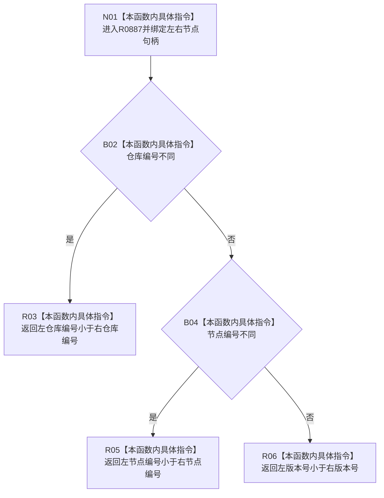

# CF-L8-0126 节点句柄小于现状流程图

图类型：现状流程图
代码版本：`03a8b7ac099ccea83e57f2696e2290b7bcdfacaf`
当前工作区复核基线：`00d917a5cf09998d2ab14d9239e1c194b5593ff0`
源码 blob：`31c9794099a8fc191c3d5d9369010c52cd863039`
覆盖文件：`海中鱼巣/领域/概念图算法.h:615-623`
唯一根函数：R0887
完整签名：`static bool 海中鱼巣::概念图算法::节点句柄小于(const 海中鱼巣::节点句柄& 左, const 海中鱼巣::节点句柄& 右)`
参数：`左`、`右` 均为调用期间有效的只读节点句柄借用
返回结果：按仓库编号、节点编号、版本号顺序形成严格小于结果
调用图：正式 main 可达关系表
已登记调用方：R0886（RCE3273）
直接项目函数：无
外部边界：无
逐行映射表：`流程图/代码流程图/L8/CF-L8-0126_节点句柄小于_逐行代码映射表.md`
不得作为施工许可：是
不得宣称：false 证明两个句柄相等或当前有效

## 流程图

## 当前边界

- 本函数只建立句柄值的字典序，不检查句柄有效性或仓库中的当前版本。
