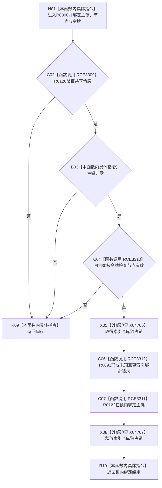

# CF-L8-0127 索引仓库绑定主键令牌重载现状流程图

图类型：现状流程图
代码版本：`03a8b7ac099ccea83e57f2696e2290b7bcdfacaf`
当前工作区复核基线：`00d917a5cf09998d2ab14d9239e1c194b5593ff0`
源码 blob：`8874312f67f19b220a08b1397c6103396878513d`
覆盖文件：`海中鱼巣/核心/索引仓库.cpp:113-118`
唯一根函数：R0890
完整签名：`bool 海中鱼巣::索引仓库::绑定主键(std::uint64_t 主键, 节点句柄 节点, const 结构事务令牌& 令牌)`
参数：`主键`、`节点` 按值；`令牌` 为调用期间有效的只读借用
返回结果：共享令牌、主键和节点均有效时返回锁内绑定结果，否则 false
调用图：正式 main 可达关系表
已登记调用方：R0889（RCE3304）
直接项目函数：R0120（RCE3309）、F0630（RCE3310）、R0122（RCE3311）、R0891（RCE3312）
外部边界：X04766、X04767
逐行映射表：`流程图/代码流程图/L8/CF-L8-0127_索引仓库绑定主键令牌重载_逐行代码映射表.md`
不得作为施工许可：是
不得宣称：true 证明调用方持有独占许可或具名索引所有权

## 流程图

## 当前边界

- 本重载只要求共享令牌有效；索引写入串行化仍由仓库独占锁承担。
