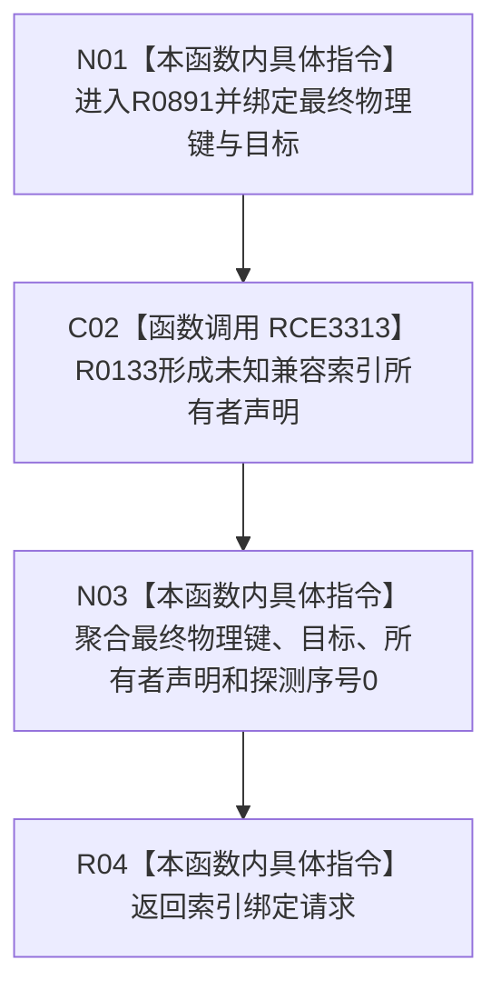

# CF-L8-0128 形成未知兼容索引绑定请求现状流程图

图类型：现状流程图
代码版本：`03a8b7ac099ccea83e57f2696e2290b7bcdfacaf`
当前工作区复核基线：`00d917a5cf09998d2ab14d9239e1c194b5593ff0`
源码 blob：`ecdd8b7888aeda86fce1ba8bc02e40b5cfa282aa`
覆盖文件：`海中鱼巣/核心/索引所有权.数据.h:122-126`
唯一根函数：R0891
完整签名：`inline 索引绑定请求 海中鱼巣::形成未知兼容索引绑定请求(std::uint64_t 最终物理键, 节点句柄 目标) noexcept`
参数：`最终物理键`、`目标` 均按值输入
返回结果：返回含最终物理键、目标、未知兼容所有者声明和探测序号 0 的索引绑定请求
调用图：正式 main 可达关系表
已登记调用方：R0889（RCE3308）、R0890（RCE3312）
直接项目函数：R0133（RCE3313）
外部边界：无
逐行映射表：`流程图/代码流程图/L8/CF-L8-0128_形成未知兼容索引绑定请求_逐行代码映射表.md`
不得作为施工许可：是
不得宣称：形成请求等于请求已经绑定、提交或取得具名所有者

## 流程图

## 当前边界

- 本函数不校验物理键或目标句柄，仅形成兼容请求值。
