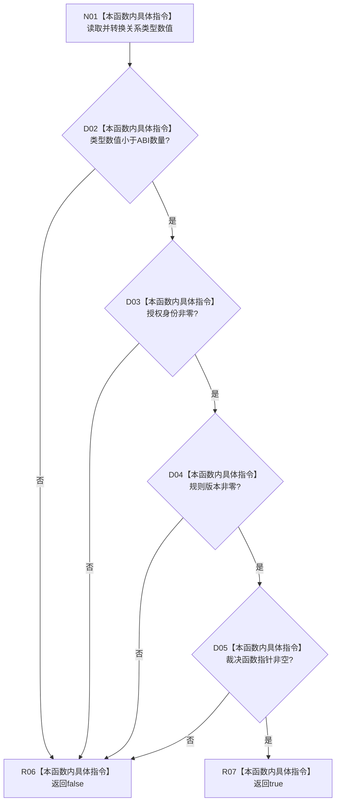

# CF-L8-0150 具名正式关系准入完整谓词现状流程图

图类型：现状流程图
代码版本：`4b80f1617dd70ec7a19e1a34efa9da768dce8927`
源码 blob：`89248cb1a21b2d49b000f92400990bb2c36ea6bc`
覆盖文件：`海中鱼巣/核心/仓库.正式关系.ixx:85-91`
唯一根函数：R1189
完整签名：`bool 海中鱼巣::具名正式关系准入::完整() const`
参数：无显式参数；只读访问当前具名准入对象
返回结果：类型、授权身份、规则版本和裁决函数指针同时有效时返回 true，否则返回 false
调用图：R1190（RCE3914）-> R1189；本函数无直接项目函数调用和外部边界
逐行映射表：`流程图/代码流程图/L8/CF-L8-0150_完整_逐行代码映射表.md`
输入契约 / 调用语境表：R1190 遍历完整正式关系准入表时逐项调用
非成功返回二分审查表：false 是完整性谓词结果，不是写入后的失败结果
偏差清单：无
依据提交 / 结构化消息：`466d1ab0`；正式身份 R1189 与边 RCE3914
验证输出：本批仅源码、关系表、Mermaid 和逐行覆盖机械验证
不得作为施工许可：是
不得宣称：true 代表准入裁决已经被调用或某条关系已获准

## 流程图

## 当前边界

- 本函数只检查四个准入字段是否齐备，不执行 `裁决`，也不检查裁决语义。
