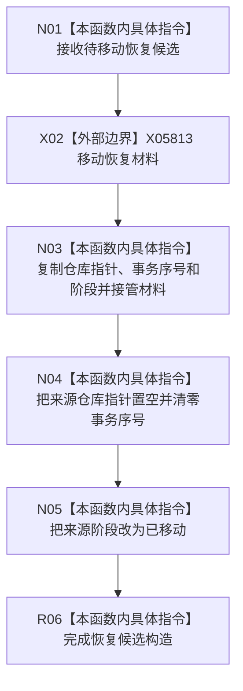

# CF-L8-0167 节点直接事务幂等恢复候选移动构造现状流程图

图类型：现状流程图
代码版本：`4b80f1617dd70ec7a19e1a34efa9da768dce8927`
源码 blob：`51f626fd79eb63dba5b57bf329ef3aae0a59abbc`
覆盖文件：`海中鱼巣/核心/仓库.节点直接事务幂等.ixx:56-62`
唯一根函数：R1313
完整签名：`海中鱼巣::节点直接事务幂等恢复候选::节点直接事务幂等恢复候选(节点直接事务幂等恢复候选&& 其它) noexcept`
参数：其它为右值引用；接管仓库指针、事务序号、恢复材料和阶段
返回结果：构造函数，无独立返回值；来源候选被标记为已移动
调用图：R1325 -> R1313；外部边界 X05813 为恢复材料 `std::move`
逐行映射表：`流程图/代码流程图/L8/CF-L8-0167_节点直接事务幂等恢复候选_逐行代码映射表.md`
输入契约 / 调用语境表：R1325 构造 optional 恢复候选时发生移动构造
非成功返回二分审查表：无显式失败返回
偏差清单：无
依据提交 / 结构化消息：`4b80f161`
验证输出：本批仅文档机械验证
不得作为施工许可：是
不得宣称：移动构造代表恢复事务已确认或发布

## 流程图

## 当前边界

- 本函数只转移本地候选材料，不读写仓库记录或侧账。
