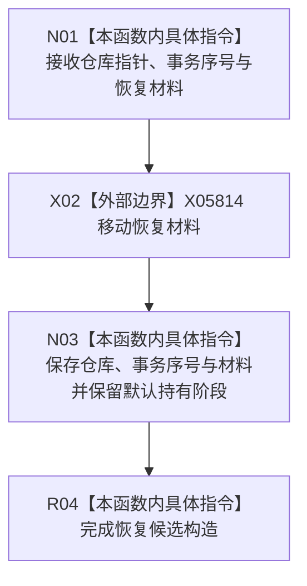

# CF-L8-0168 节点直接事务幂等恢复候选私有构造现状流程图

图类型：现状流程图
代码版本：`4b80f1617dd70ec7a19e1a34efa9da768dce8927`
源码 blob：`51f626fd79eb63dba5b57bf329ef3aae0a59abbc`
覆盖文件：`海中鱼巣/核心/仓库.节点直接事务幂等.ixx:67-69`
唯一根函数：R1314
完整签名：`海中鱼巣::节点直接事务幂等恢复候选::节点直接事务幂等恢复候选(节点直接事务幂等仓库* 仓库, std::uint64_t 事务序号, 节点直接事务幂等仓库恢复材料 材料)`
参数：仓库为非拥有指针；事务序号按值；材料按值接收后移动保存
返回结果：构造函数，无独立返回值；形成默认处于持有阶段的恢复候选
调用图：R1325 -> R1314；外部边界 X05814 为恢复材料 `std::move`
逐行映射表：`流程图/代码流程图/L8/CF-L8-0168_节点直接事务幂等恢复候选_逐行代码映射表.md`
输入契约 / 调用语境表：R1325 在恢复事务序号占位后构造恢复候选
非成功返回二分审查表：无显式失败返回
偏差清单：无
依据提交 / 结构化消息：`4b80f161`
验证输出：本批仅文档机械验证
不得作为施工许可：是
不得宣称：恢复候选构造代表材料已经恢复或发布

## 流程图

## 当前边界

- 本函数不验证恢复材料，也不直接改写仓库或侧账。
