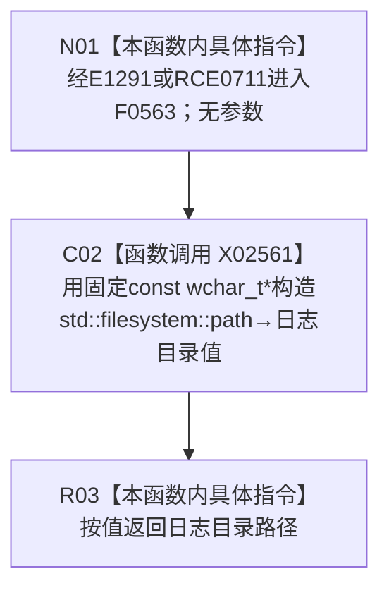

# CF-L9-0001 日志目录路径现状流程图

图类型：现状流程图
代码版本：`14d539ed7ad8af87f35fb0752eed420bbe443316`
源码 blob：`10e98724294f1316bf3ae1bf0266d8334365e033`
覆盖文件：`海中鱼巣/核心/日志系统.h:67-69`
唯一根函数：F0563
完整签名：`std::filesystem::path 海中鱼巣::日志目录路径()`
参数：无
返回结果：返回由固定宽字符串 `L"D:\\海中鱼巣\\日志"` 构造的 `std::filesystem::path`
已登记调用方：F0268 经 E1291 调用；R0197 经 RCE0711 调用
直接项目函数：无
外部边界：X02561→`std::filesystem::path` 从 `const wchar_t*` 构造
未解析项目调用：0
调用图：`流程图/主程序可达调用关系/01_main可达项目调用边表.md`
逐行映射表：`流程图/代码流程图/L9/CF-L9-0001_日志目录路径_逐行代码映射表.md`
偏差清单：无；本文只冻结当前代码事实
依据提交 / 结构化消息：当前提交、F0563、E1291、RCE0711、X02561 与源码 67—69 行交叉复核
结构读取与写入：不读取或写入文件系统；只构造路径值
逻辑内返回：固定路径值为唯一正常返回
内部错误：本函数没有显式错误分支
生命周期与资源释放：字符串字面量具有静态存储期；path 按值返回
异常：未捕获；X02561 构造异常沿调用栈传播
并发 / 幂等：纯值构造；相同代码基线下重复调用形成等值路径
验证输出：67—69 行完整映射；2 条项目入边、0 个项目出边、1 个外部边界、0 个未解析调用
不得作为施工许可：是
不得宣称：返回路径证明目录存在、可访问、日志已写入或日志系统已经完成

## 流程图

## 节点合同

| 节点 | 类型 | 输入绑定 | 输出绑定 | 事实读写 | 后继 |
| --- | --- | --- | --- | --- | --- |
| N01 | 本函数内具体指令 | 无参数；E1291 或 RCE0711 调用语境 | 进入固定值构造 | 无 | C02 |
| C02 | 函数调用 | `L"D:\\海中鱼巣\\日志"` | X02561 构造的 path 临时值 | 不访问文件系统 | R03 |
| R03 | 本函数内具体指令 | path 临时值 | 按值返回 | 无 | 结束 |

## 当前边界

- 本函数只形成路径对象，不创建目录、不检查存在性、不打开或写入日志文件。
- 固定盘符和目录文字是当前代码事实；本图不把它提升为目标配置合同或运行成功证据。
