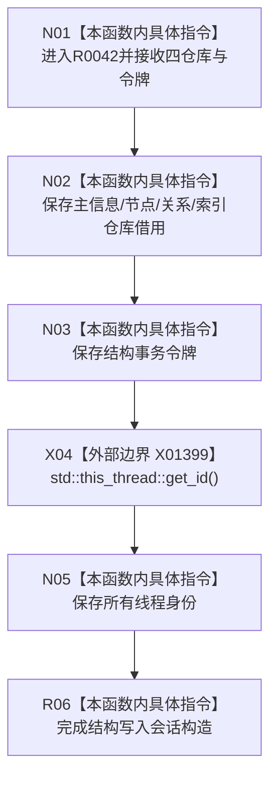

# CF-L9-0002 结构写入会话构造现状流程图

图类型：现状流程图
代码版本：`3920a74638264f9f539d50f32f3c9fe5fb1982ab`
源码 blob：`df70de9c299c74f7f0766a3e94facaf504f57968`
覆盖文件：`海中鱼巣/核心/会话.结构写入.ixx:717-725`
唯一根函数：R0042
完整签名：`海中鱼巣::结构写入会话::结构写入会话(海中鱼巣::主信息仓库& 主信息, 海中鱼巣::节点仓库& 节点, 海中鱼巣::关系仓库& 关系, 海中鱼巣::索引仓库& 索引, 海中鱼巣::结构事务令牌 令牌)`
参数：四个仓库均为可修改借用；令牌按值传入
返回结果：构造完成的结构写入会话，保存四个仓库借用、令牌和值化的当前线程身份
直接项目函数：无
外部边界：X01399
调用图：`流程图/主程序可达调用关系/01_main可达项目调用边表.md`
逐行映射表：`流程图/代码流程图/L9/CF-L9-0002_结构写入会话构造_逐行代码映射表.md`
偏差清单：无；结构变化：新会话绑定仓库、令牌与构造线程
验证输出：717—725 行完整映射；不得作为施工许可：是；不得宣称：构造完成等于事务已开始或已提交

## 流程图

