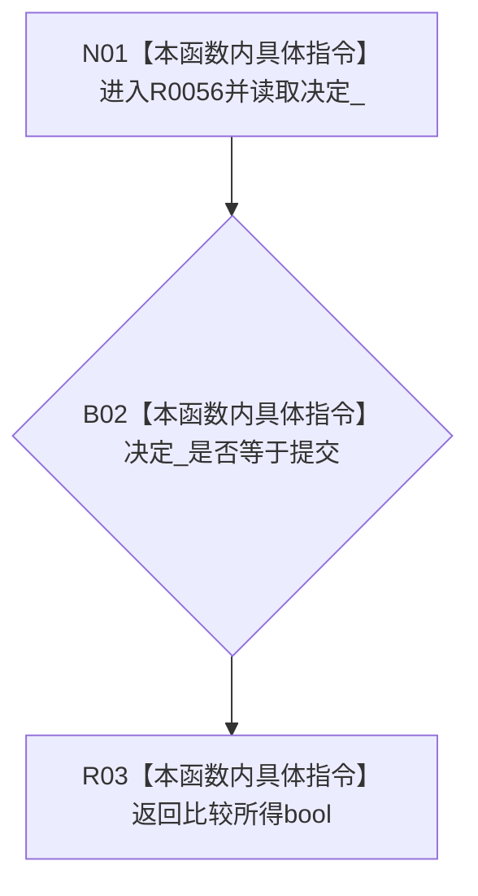

# CF-L9-0003 结构写入会话已请求提交现状流程图

图类型：现状流程图
代码版本：`176b674a6c1499ccdd7306f30f910fec6dc5079c`
源码 blob：`df70de9c299c74f7f0766a3e94facaf504f57968`
覆盖文件：`海中鱼巣/核心/会话.结构写入.ixx:840`
唯一根函数：R0056
完整签名：`bool 海中鱼巣::结构写入会话::已请求提交() const`
参数：无显式参数；const `this` 为借用
返回结果：当前决定等于提交时返回 true，否则返回 false
已登记调用方：R0060 经 RCE0405；R0116 经 RCE0569
直接项目函数：无；外部边界：无；未解析项目调用：0
调用图：`流程图/主程序可达调用关系/01_main可达项目调用边表.md`
逐行映射表：`流程图/代码流程图/L9/CF-L9-0003_结构写入会话已请求提交_逐行代码映射表.md`
偏差清单：无；结构读取与写入：只读 `决定_`
逻辑内返回：未决定或撤销均返回 false
验证输出：840 行完整映射；不得作为施工许可：是
不得宣称：返回 true 证明提交已经确认或发布

## 流程图

