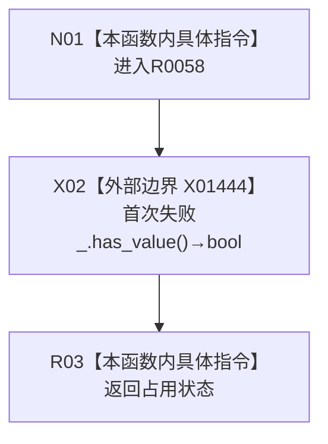

# CF-L9-0005 结构写入会话有失败现状流程图

图类型：现状流程图
代码版本：`176b674a6c1499ccdd7306f30f910fec6dc5079c`
源码 blob：`df70de9c299c74f7f0766a3e94facaf504f57968`
覆盖文件：`海中鱼巣/核心/会话.结构写入.ixx:842`
唯一根函数：R0058
完整签名：`bool 海中鱼巣::结构写入会话::有失败() const`
参数：无显式参数；const `this` 为借用
返回结果：首次失败 optional 有值时返回 true，否则返回 false
已登记调用方：R0060 经 RCE0406；R0102 经 RCE0527；R0116 经 RCE0567
直接项目函数：无
外部边界：X01444 `首次失败_.has_value()`；未解析项目调用：0
调用图：`流程图/主程序可达调用关系/01_main可达项目调用边表.md`
逐行映射表：`流程图/代码流程图/L9/CF-L9-0005_结构写入会话有失败_逐行代码映射表.md`
偏差清单：无；结构读取与写入：只读首次失败占用状态
逻辑内返回：无失败时返回 false
验证输出：842 行完整映射；不得作为施工许可：是
不得宣称：返回 false 证明后续确认一定成功

## 流程图

