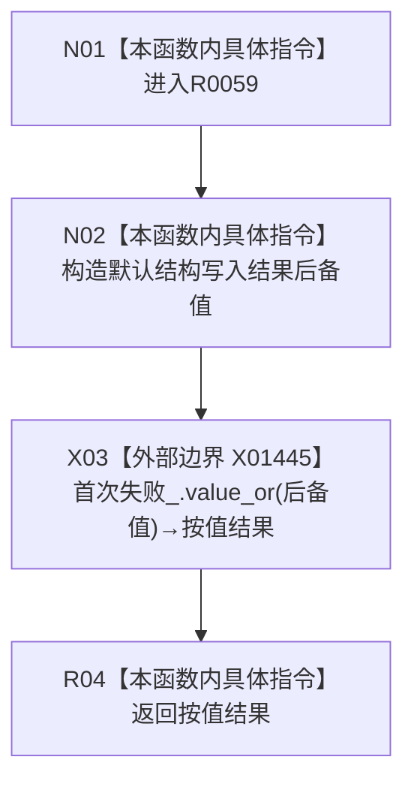

# CF-L9-0006 结构写入会话读取首次失败现状流程图

图类型：现状流程图
代码版本：`176b674a6c1499ccdd7306f30f910fec6dc5079c`
源码 blob：`df70de9c299c74f7f0766a3e94facaf504f57968`
覆盖文件：`海中鱼巣/核心/会话.结构写入.ixx:843`
唯一根函数：R0059
完整签名：`海中鱼巣::结构写入结果 海中鱼巣::结构写入会话::读取首次失败() const`
参数：无显式参数；const `this` 为借用
返回结果：首次失败存在时按值返回；不存在时返回默认构造的结构写入结果
已登记调用方：R0102 经 RCE0528；R0116 经 RCE0568
直接项目函数：无
外部边界：X01445 `首次失败_.value_or(结构写入结果{})`；未解析项目调用：0
调用图：`流程图/主程序可达调用关系/01_main可达项目调用边表.md`
逐行映射表：`流程图/代码流程图/L9/CF-L9-0006_结构写入会话读取首次失败_逐行代码映射表.md`
偏差清单：无；结构读取与写入：只读首次失败并形成按值结果
逻辑内返回：无首次失败时返回默认结果材料
验证输出：843 行完整映射；不得作为施工许可：是
不得宣称：默认结果表示一次真实失败已经发生

## 流程图

