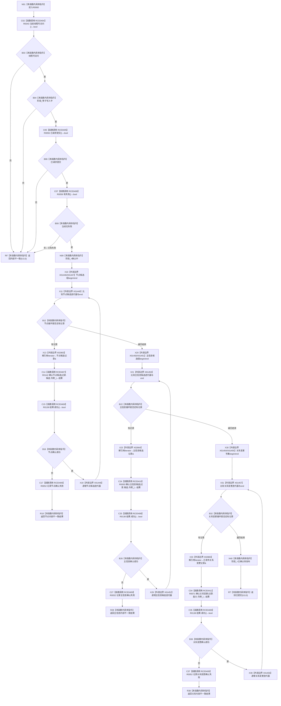

# CF-L9-0007 结构写入会话完成确认现状流程图

图类型：现状流程图
代码版本：`176b674a6c1499ccdd7306f30f910fec6dc5079c`
源码 blob：`df70de9c299c74f7f0766a3e94facaf504f57968`
覆盖文件：`海中鱼巣/核心/会话.结构写入.ixx:845-873`
唯一根函数：R0060
完整签名：`海中鱼巣::结构写入结果 海中鱼巣::结构写入会话::完成确认()`
参数：无显式参数；`this` 为可修改借用
返回结果：入口状态不一致或任一候选确认失败时返回内部不一致；三类候选全部确认后返回已提交
已登记调用方：R0102 经 RCE0533；R0116 经 RCE0570
直接项目函数：RCE0404→R0043；RCE0405→R0056；RCE0406→R0058；RCE0407→R0142；RCE0408→R0138；RCE0409→R0052；RCE0410→R0003；RCE0411→R0071
外部边界：X01446—X01457；X02863—X02865
未解析项目调用：0
调用图：`流程图/主程序可达调用关系/01_main可达项目调用边表.md`
逐行映射表：`流程图/代码流程图/L9/CF-L9-0007_结构写入会话完成确认_逐行代码映射表.md`
偏差清单：任一确认失败时已完成的前序确认不在本函数内撤销；本文只冻结该当前代码事实
结构读取与写入：入口通过后阶段改为确认中；逐项确认节点、主信息和关系变更；全成功后阶段改为已确认待发布
逻辑内返回：入口合同不满足时返回内部不一致材料；确认失败属于内部错误收口
验证输出：845—873 行完整映射；不得作为施工许可：是
不得宣称：返回已提交证明结构已经发布或持久化完成

## 流程图

