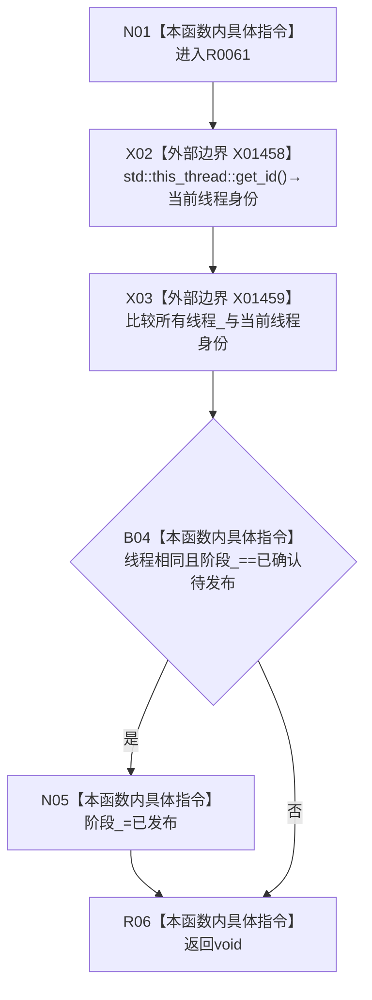

# CF-L9-0008 结构写入会话完成发布现状流程图

图类型：现状流程图
代码版本：`176b674a6c1499ccdd7306f30f910fec6dc5079c`
源码 blob：`df70de9c299c74f7f0766a3e94facaf504f57968`
覆盖文件：`海中鱼巣/核心/会话.结构写入.ixx:924-928`
唯一根函数：R0061
完整签名：`void 海中鱼巣::结构写入会话::完成发布() noexcept`
参数：无显式参数；`this` 为可修改借用
返回结果：`void`；只有构造线程且阶段为已确认待发布时把阶段改为已发布
直接项目函数：无
已登记调用方：RCE0535（R0102→R0061）、RCE0552（R0116→R0061）
外部边界：X01458、X01459；未解析调用：0
调用图：`流程图/主程序可达调用关系/01_main可达项目调用边表.md`
逐行映射表：`流程图/代码流程图/L9/CF-L9-0008_结构写入会话完成发布_逐行代码映射表.md`
输入契约 / 调用语境表：本图入口与 B04；非成功返回二分审查表：B04→R06
偏差清单：无；依据提交 / 结构化消息：当前源码、X01458、X01459
验证输出：924—928 行完整映射；不得作为施工许可：是
不得宣称：返回 `void` 或阶段未改变等于发布成功

## 流程图

