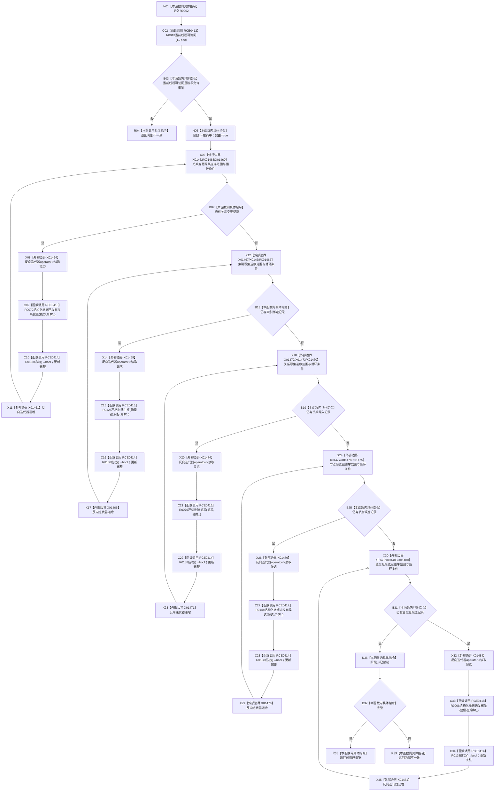

# CF-L9-0009 结构写入会话完成撤销现状流程图

图类型：现状流程图
代码版本：`176b674a6c1499ccdd7306f30f910fec6dc5079c`
源码 blob：`df70de9c299c74f7f0766a3e94facaf504f57968`
覆盖文件：`海中鱼巣/核心/会话.结构写入.ixx:930-955`
唯一根函数：R0062
完整签名：`海中鱼巣::结构写入结果 海中鱼巣::结构写入会话::完成撤销()`
参数：无显式参数；`this` 为可修改借用
返回结果：非法线程 / 阶段或任一逆序撤销失败返回内部不一致；全部成功返回候选已撤销
直接项目函数：RCE0412→R0043；RCE0413→R0072；RCE0414→R0138；RCE0415→R0125；RCE0416→R0076；RCE0417→R0144；RCE0418→R0006
已登记调用方：RCE0525（R0102→R0062）、RCE0564（R0116→R0062）
外部边界：X01460—X01484；未解析调用：0
调用图：`流程图/主程序可达调用关系/01_main可达项目调用边表.md`
逐行映射表：`流程图/代码流程图/L9/CF-L9-0009_结构写入会话完成撤销_逐行代码映射表.md`
输入契约 / 调用语境表：本图入口与 B03；非成功返回二分审查表：R04、R39
偏差清单：无；依据提交 / 结构化消息：当前源码、RCE0412—RCE0418、X01460—X01484
验证输出：930—955 行完整映射；不得作为施工许可：是
不得宣称：阶段写为已撤销等于每一项底层撤销都成功

## 流程图

